# Architecture Documentation

**Last Updated:** October 2025 (Sprint 38)
**Status:** Current (Post-Stabilization)

---

## Table of Contents

1. [System Overview](#system-overview)
2. [Presentation Save Flow](#presentation-save-flow)
3. [Authentication & Security](#authentication--security)
4. [Database Schema](#database-schema)
5. [Architecture Evolution](#architecture-evolution)
6. [Deployment Architecture](#deployment-architecture)

---

## System Overview

Productory Powerups for Gamma is a Chrome extension that captures presentation slides from gamma.app and provides cloud synchronization capabilities. The system consists of three main components:

### Components

1. **Chrome Extension** (`packages/extension/`)
   - Content script: Extracts slides from gamma.app DOM
   - Background service: Manages extension lifecycle and API communication
   - Sidebar UI: User interface for viewing/managing presentations
   - Storage Manager: Handles local and cloud data persistence

2. **Web Application** (`packages/web/`)
   - Next.js 14 app (App Router architecture)
   - API routes for presentation CRUD operations
   - Dashboard for presentation management
   - Device pairing and authentication flows

3. **Database** (Supabase PostgreSQL)
   - User authentication (Supabase Auth)
   - Device token management
   - Presentation storage with RLS policies
   - SECURITY DEFINER RPCs for controlled access

---

## Presentation Save Flow

### Current State (Post Sprint 38 - October 2025)

The presentation save flow has been simplified from a two-step RPC process to a single atomic operation.

#### Architecture Changes

**✅ Removed:**
- Two-step RPC flow (`rpc_sync_user_from_auth` → `rpc_upsert_presentation_from_device`)
- Intermediate user synchronization step
- Type conversion complexity between TEXT and UUID

**✅ Added:**
- Single RPC `rpc_upsert_presentation_from_device` with UUID validation
- Atomic user sync + presentation upsert in one transaction
- Enhanced error handling with debug metadata
- Clear separation between device-token and web-session paths

#### Data Flow Sequence

```mermaid
sequenceDiagram
    participant User
    participant Extension
    participant ContentScript
    participant Background
    participant API
    participant Database

    User->>ContentScript: Views gamma.app presentation
    ContentScript->>Background: Extracts slides data
    Background->>Extension: Stores locally
    User->>Extension: Clicks "Save to Cloud"
    Extension->>API: POST /api/presentations/save (device-token auth)
    API->>API: Validate request (Zod schema)
    API->>Database: rpc_upsert_presentation_from_device(auth_id, url, data)
    Database->>Database: UPSERT users (auth_id → user_id)
    Database->>Database: UPSERT presentations (user_id, gamma_url)
    Database->>API: Return presentation record
    API->>Extension: 200 OK { presentation }
    Extension->>User: "Saved successfully!"
```



#### Request/Response Contract

**Request (Extension → API):**
```typescript
POST /api/presentations/save
Headers: {
  "Authorization": "Bearer <device-token>",
  "Content-Type": "application/json"
}
Body: {
  gamma_url: "https://gamma.app/docs/{uuid}",
  title: "Presentation Title",
  start_time: "09:00",  // optional
  total_duration: 3600,  // optional (seconds)
  timetable_data: {      // JSONB
    title: "...",
    items: [...]
  }
}
```

**Success Response (200 OK):**
```typescript
{
  success: true,
  presentation: {
    id: "uuid",
    title: "Presentation Title",
    presentationUrl: "https://gamma.app/docs/{uuid}",
    startTime: "09:00",
    totalDuration: 3600,
    slideCount: 10,
    timetableData: {...},
    createdAt: "2025-10-05T...",
    updatedAt: "2025-10-05T..."
  },
  message: "Presentation saved"
}
```

**Error Response (400/401/500):**
```typescript
{
  error: "Failed to save presentation",
  debug: {
    code: "P0001" | "VALIDATION_ERROR" | "22004",
    message: "Detailed error message",
    details: "Additional context",
    hint: "Suggested fix"
  }
}
```

#### Database RPC Implementation

**Function:** `rpc_upsert_presentation_from_device`

**Purpose:** Atomic user sync + presentation upsert in single SECURITY DEFINER operation

**Parameters:**
- `p_auth_id` (uuid, required): auth.users.id from device token validation
- `p_gamma_url` (text, required): Canonical gamma.app URL
- `p_title` (text, required): Presentation title
- `p_timetable_data` (jsonb, required): Slide timetable data
- `p_start_time` (text, optional): Default "09:00"
- `p_total_duration` (integer, optional): Default 0
- `p_email` (text, optional): User email for user record

**Logic Flow:**
```sql
1. Validate p_auth_id NOT NULL (ERRCODE 22004 if null)

2. UPSERT users table:
   INSERT INTO users (auth_id, email)
   VALUES (p_auth_id, p_email)
   ON CONFLICT (auth_id) DO UPDATE
     SET email = COALESCE(EXCLUDED.email, users.email),
         updated_at = NOW()
   RETURNING id INTO v_user_id

3. UPSERT presentations table:
   INSERT INTO presentations (user_id, gamma_url, title, ...)
   VALUES (v_user_id, p_gamma_url, p_title, ...)
   ON CONFLICT (user_id, gamma_url) DO UPDATE
     SET title = EXCLUDED.title,
         timetable_data = EXCLUDED.timetable_data,
         updated_at = NOW()
   RETURNING *
```

**Security:** SECURITY DEFINER with GRANT to `anon, authenticated`

#### Error Handling

The API route provides comprehensive error handling with debug information:

| Status | Error Code | Meaning | User Action |
|--------|-----------|---------|-------------|
| 400 | VALIDATION_ERROR | Invalid request format | Check gamma_url format, validate JSON |
| 401 | - | Missing/invalid device token | Re-pair device via extension |
| 404 | P0001 | User not found in auth.users | Re-authenticate or contact support |
| 500 | 22004 | auth_id is null/invalid | Check device token validity |
| 500 | DATABASE_ERROR | RPC execution failed | Check Supabase logs, verify UUID format |

---

## Authentication & Security

### Device Token Authentication

**Flow:**
1. User registers device via web app → generates pairing code
2. Extension exchanges pairing code for device token (httpOnly cookie)
3. Extension includes device token in API requests
4. API validates token via `validate_and_touch_token` RPC
5. Returns `authUser.userId` (auth.users.id UUID)

**Token Storage:**
- **Extension:** Stored in browser extension storage (not accessible to web pages)
- **Web App:** httpOnly cookie (prevents XSS attacks)
- **Database:** SHA-256 hashed in `device_tokens` table

**Token Validation RPC:**
```sql
CREATE FUNCTION validate_and_touch_token(raw_token text)
RETURNS TABLE(user_id uuid, user_email text, device_id uuid)
SECURITY DEFINER
AS $$
  SELECT dt.user_id, dt.user_email, dt.device_id
  FROM device_tokens dt
  WHERE dt.token = digest(raw_token, 'sha256')
    AND dt.expires_at > NOW()
    AND dt.revoked = false
  -- Touch last_used timestamp
  RETURNING user_id, user_email, device_id;
$$;
```

### Row-Level Security (RLS)

**Presentations Table:**
```sql
-- Users can only access their own presentations
CREATE POLICY "Users can CRUD own presentations"
ON presentations FOR ALL
USING (user_id IN (
  SELECT id FROM users WHERE auth_id = auth.uid()
));
```

**Device Tokens Table:**
```sql
-- Users can only view their own device tokens
CREATE POLICY "Users can view own tokens"
ON device_tokens FOR SELECT
USING (user_id = auth.uid());
```

### Security Model Principles

1. **Defense in Depth:**
   - RLS policies at database level
   - SECURITY DEFINER RPCs for controlled operations
   - httpOnly cookies for token storage
   - CORS restrictions on API routes

2. **Least Privilege:**
   - Extension uses `anon` role (not `authenticated`)
   - RPCs grant only necessary permissions
   - Service role only for admin operations

3. **Input Validation:**
   - Zod schemas validate all API inputs
   - UUID format validation prevents injection
   - URL canonicalization ensures consistency

---

## Database Schema

### Core Tables

#### users
First-party user records (synced from Supabase Auth)

```sql
CREATE TABLE users (
  id uuid PRIMARY KEY DEFAULT gen_random_uuid(),
  auth_id uuid UNIQUE NOT NULL,  -- References auth.users.id
  email text,
  created_at timestamptz DEFAULT NOW(),
  updated_at timestamptz DEFAULT NOW()
);

CREATE INDEX idx_users_auth_id ON users(auth_id);
```

#### presentations
User presentation data

```sql
CREATE TABLE presentations (
  id uuid PRIMARY KEY DEFAULT gen_random_uuid(),
  user_id uuid NOT NULL REFERENCES users(id) ON DELETE CASCADE,
  gamma_url text NOT NULL,
  title text NOT NULL,
  start_time text DEFAULT '09:00',
  total_duration integer DEFAULT 0,
  timetable_data jsonb NOT NULL,
  created_at timestamptz DEFAULT NOW(),
  updated_at timestamptz DEFAULT NOW(),

  -- Unique constraint: one presentation per user per gamma_url
  CONSTRAINT unique_user_gamma_url UNIQUE (user_id, gamma_url)
);

-- Performance indexes (Sprint 35)
CREATE INDEX idx_presentations_user_updated
  ON presentations (user_id, updated_at DESC);

CREATE INDEX idx_presentations_gamma_url
  ON presentations (gamma_url);
```

#### device_tokens
Device authentication tokens

```sql
CREATE TABLE device_tokens (
  id uuid PRIMARY KEY DEFAULT gen_random_uuid(),
  device_id uuid NOT NULL,
  user_id uuid NOT NULL,  -- auth.users.id (UUID)
  user_email text,
  token bytea NOT NULL UNIQUE,  -- SHA-256 hash
  expires_at timestamptz NOT NULL,
  last_used timestamptz,
  revoked boolean DEFAULT false,
  created_at timestamptz DEFAULT NOW()
);

CREATE INDEX idx_device_tokens_token ON device_tokens(token);
CREATE INDEX idx_device_tokens_user ON device_tokens(user_id);
```

### Key RPCs

#### rpc_upsert_presentation_from_device
Atomic user sync + presentation save (SECURITY DEFINER)

**See [Presentation Save Flow](#database-rpc-implementation) for detailed implementation.**

#### validate_and_touch_token
Device token validation with activity tracking (SECURITY DEFINER)

```sql
CREATE FUNCTION validate_and_touch_token(raw_token text)
RETURNS TABLE(user_id uuid, user_email text, device_id uuid)
LANGUAGE plpgsql SECURITY DEFINER
AS $$
BEGIN
  RETURN QUERY
  UPDATE device_tokens dt
  SET last_used = NOW()
  WHERE dt.token = digest(raw_token, 'sha256')
    AND dt.expires_at > NOW()
    AND dt.revoked = false
  RETURNING dt.user_id, dt.user_email, dt.device_id;
END;
$$;
```

---

## Architecture Evolution

### Sprint Timeline

#### Sprint 26 (September 2025): Initial Implementation
- ✅ Implemented device-token save path with SECURITY DEFINER RPCs
- ✅ Fixed payload contract mismatch (camelCase → snake_case)
- ✅ All saves working through `rpc_upsert_presentation_from_device`
- **Status:** Stable and functional

#### Sprint 35 (September 2025): Rollback
- ❌ Sprint 36 attempted token hashing changes that broke device pairing
- 🔄 Hard reset to pre-Sprint 36 state (commit f2b80bb)
- 🔄 Removed problematic migrations with digest() and device_fingerprint
- **Status:** Reverted to Sprint 26 implementation

#### Sprint 37 (October 3, 2025): Emergency Fixes
- 🐛 Issue: 500 errors on presentation save via extension
- 🔍 Root cause: `rpc_sync_user_from_auth` called with TEXT instead of UUID
- ✅ Fix 1: Added UUID validation and enhanced error handling
- ✅ Fix 2: Simplified RPC flow - removed intermediate sync, direct upsert
- **Status:** Functional but needs validation

#### Sprint 38 (October 5, 2025): Stabilization
- 🔒 Production validation and testing
- 🛠️ Local development environment setup
- 📝 Documentation and troubleshooting runbooks
- **Status:** Current (stable)

### Key Architectural Decisions

1. **Single RPC Operation (Sprint 37)**
   - **Decision:** Merge user sync + presentation upsert into single RPC
   - **Rationale:** Eliminates round-trip latency and type conversion issues
   - **Impact:** Reduced complexity, improved reliability

2. **SECURITY DEFINER Pattern**
   - **Decision:** Use SECURITY DEFINER RPCs for device-token operations
   - **Rationale:** Extension uses `anon` role but needs write access
   - **Impact:** RLS compliant, controlled privilege escalation

3. **UUID-based User IDs**
   - **Decision:** Use auth.users.id (UUID) as canonical user identifier
   - **Rationale:** Consistency with Supabase Auth, prevents type mismatches
   - **Impact:** Simplified token validation, clear data ownership

---

## Deployment Architecture

### Infrastructure

**Hosting:**
- Web App: Netlify (Edge Functions + Static Hosting)
- Database: Supabase PostgreSQL (hosted)
- Extension: Chrome Web Store

**Environments:**
- **Production:** `productory-powerups.netlify.app`
- **Local Development:** `localhost:3000` (Next.js dev server)

### Build System

**Environment-Specific Builds:**

```javascript
// vite.config.js
export default defineConfig({
  define: {
    __BUILD_ENV__: JSON.stringify(process.env.BUILD_ENV || 'production'),
  }
});

// Build commands
npm run build         // Production: productory-powerups.netlify.app
npm run build:local   // Local: localhost:3000
```

**Tree Shaking:**
- Vite replaces `__BUILD_ENV__` at build time
- Unused environment configs removed from bundle
- No runtime overhead for environment detection

**Configuration Files:**
- `environment.production.ts`: Production API endpoints, debugMode=false
- `environment.local.ts`: Local API endpoints, debugMode=true
- `shared-config/index.ts`: Environment selection logic

### Deployment Process

**Extension Deployment:**
1. Build production extension: `npm run build`
2. Test with production API
3. Package `dist/` folder
4. Upload to Chrome Web Store (manual)

**Web App Deployment:**
1. Commit to `main` branch
2. Netlify auto-deploys from GitHub
3. Edge Functions deployed automatically
4. Environment variables configured in Netlify dashboard

**Database Migrations:**
1. Create migration: `supabase migration new <name>`
2. Write SQL in `supabase/migrations/`
3. Test locally: `supabase db reset`
4. Deploy: `supabase db push --linked --include-all`
5. Validate: Check Supabase Dashboard

---

## Performance Considerations

### Database Optimizations (Sprint 35)

**Indexes:**
```sql
-- User presentation lookups (dashboard)
CREATE INDEX idx_presentations_user_updated
  ON presentations (user_id, updated_at DESC);

-- URL canonicalization lookups
CREATE INDEX idx_presentations_gamma_url
  ON presentations (gamma_url);

-- Device token validation
CREATE INDEX idx_device_tokens_token
  ON device_tokens(token);
```

**Query Patterns:**
- Use RLS-compliant queries (user_id filter always included)
- Limit result sets (pagination)
- Use `CONCURRENTLY` for index creation on large tables

### API Performance

**Netlify Edge Functions:**
- Auto-scaling based on traffic
- Edge caching for static responses
- Function timeout: 10 seconds max

**Optimization Strategies:**
- Minimize RPC round-trips (single atomic operations)
- Use connection pooling (Supabase handles this)
- Cache-Control headers on static responses

---

## Security Audit Trail

### Vulnerability Mitigations

1. **SQL Injection:** Parameterized queries, Zod validation, UUID format checks
2. **XSS:** httpOnly cookies, CSP headers, sanitized outputs
3. **CSRF:** SameSite cookie attributes, CORS restrictions
4. **Privilege Escalation:** RLS policies, SECURITY DEFINER only where needed
5. **Token Theft:** SHA-256 hashing, httpOnly cookies, short expiry (24h)

### Compliance

- **GDPR:** User data deletions cascade (ON DELETE CASCADE)
- **Data Minimization:** Only store necessary fields
- **Encryption:** TLS in transit, SHA-256 for tokens, RLS for access control

---

## Future Improvements

**Identified in Sprint 38 (Out of Scope):**

1. **Token Refresh Flow:** Extend sessions without re-pairing
2. **Multi-Environment UI:** Extension selector for dev/staging/prod
3. **Automated Token Cleanup:** Cron job to purge expired tokens
4. **Real-time Sync:** WebSockets for instant updates
5. **Offline Queue:** Retry failed saves when back online

---

**Document Maintained By:** Development Team
**Review Cycle:** After each major sprint
**Last Reviewed:** October 2025 (Sprint 38)
