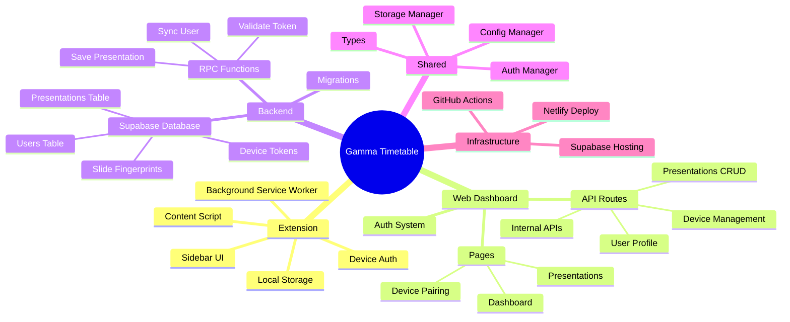
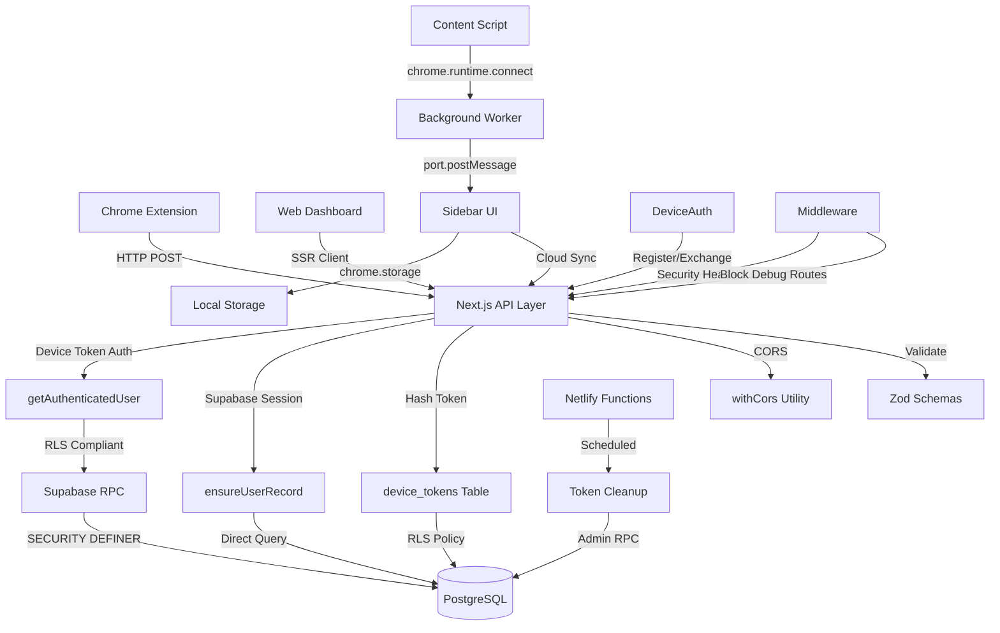

# Codemap: Gamma Timetable Extension

**Repository:** gamma-plugin
**Primary Languages:** TypeScript, JavaScript
**Project Goal:** Transform Gamma presentations into synchronized, cloud-enabled timetables
**Analysis Date:** 2025-11-06
**Version:** 0.0.63 (Extension) / 0.2.0 (Web)

---

## 1) Repository Overview

The Gamma Timetable Extension is a full-stack application that extracts slide content from Gamma presentations and generates customizable timetables. The system consists of a Chrome MV3 extension that operates on `gamma.app` pages, a Next.js web dashboard for user management, and a Supabase backend for secure data persistence. The extension uses a background service worker for message routing, a content script for DOM extraction, and a sidebar interface for timetable generation. Web dashboard handles device pairing, authentication via Supabase Auth, and presentation management with Row-Level Security (RLS) enforcement.

**Main Runtime:** Chrome Extension (MV3) + Next.js 15 (React 19) + Supabase PostgreSQL

**Key Entry Points:**
- Extension: `packages/extension/background.js`, `packages/extension/sidebar/sidebar.js`
- Web: `packages/web/src/app/page.tsx`, `packages/web/src/app/api/presentations/save/route.ts`
- Shared: `packages/shared/index.ts`

| Package/Module | Role |
|----------------|------|
| `packages/extension/` | Chrome MV3 extension - content extraction, timetable generation, device auth |
| `packages/web/` | Next.js 15 web dashboard - user auth, presentation CRUD, device pairing UI |
| `packages/shared/` | Shared utilities - auth abstraction, storage sync, type definitions |
| `packages/simulator/` | Local testing tool - simulates extension environment for development |
| `supabase/migrations/` | PostgreSQL schema - 43 migrations, RLS policies, RPCs |
| `netlify/functions/` | Serverless functions - scheduled cleanup tasks |
| `tests/` | Test suite - E2E (Playwright), integration, performance, migration |
| `docs/` | Documentation - architecture, sprints, security, guides |

---

## 2) File Tree Snapshot

```
gamma-plugin/
  packages/
    extension/
      background.js              # Service worker - message broker, connection health
      content.ts                 # DOM extraction from gamma.app
      sidebar/
        sidebar.js               # Main UI - timetable generation, sync, exports
        sidebar.html
        sidebar.css
      lib/
        timetable.js             # Core timetable logic, XLSX/CSV generation
        storage.js               # Chrome storage wrapper, sync utilities
        durationSuggestions.js   # Fetch AI-powered duration suggestions
      auth/
        index.ts                 # Device authentication flow
      shared-config/
        environment.local.ts     # Local dev config (localhost:3000)
        environment.production.ts # Production config (Netlify)
      manifest.json              # Chrome extension manifest v3
    
    web/
      src/
        app/
          api/
            presentations/
              save/route.ts      # POST /api/presentations/save (RPC/direct)
              get/route.ts       # GET presentation by gamma_url
              list/route.ts      # GET user presentations list
            devices/
              register/route.ts  # Device registration (pairing step 1)
              exchange/route.ts  # Device token exchange (pairing step 2)
              link/route.ts      # Device code validation endpoint
            user/
              profile/route.ts   # User profile CRUD
              devices/route.ts   # List user devices
            _internal/           # Internal APIs (require auth token)
            admin/               # Admin APIs (require admin access)
          page.tsx               # Dashboard home
          presentations/
            page.tsx             # Presentation list view
          auth/
            page.tsx             # Auth pages
        components/
          DevicePairingDashboard.tsx  # Device pairing UI
          PresentationCard.tsx        # Presentation list item
        utils/
          auth-helpers.ts        # Unified auth (device token + session)
          supabase/
            server.ts            # SSR Supabase client
            client.ts            # Client-side Supabase client
          cors.ts                # CORS utilities
          url.ts                 # URL canonicalization
        schemas/
          presentations.ts       # Zod validation schemas
      middleware.ts              # Next.js middleware (auth, security)
      next.config.js
      package.json
    
    shared/
      types/index.ts             # Shared TypeScript types
      auth/
        index.ts                 # Unified auth manager
        device.ts                # Device auth abstraction
      storage/
        index.ts                 # Storage manager (local + cloud sync)
      config/
        index.ts                 # Feature flags, environment config
      ui/
        gamma-components.tsx     # React components (future)
      index.ts                   # Package entry point
  
  supabase/
    migrations/
      20240718000001_initial_schema.sql  # Initial tables
      20250831000004_migrate_auth_system.sql  # Supabase Auth migration
      20250901183919_sprint26_presentations_rpc.sql  # RPC functions
      20251004101500_update_presentations_rpc_auth_sync.sql  # Device auth RPC
      ... (39 more migrations)
    config.toml                  # Supabase project config
  
  tests/
    e2e/                         # Playwright E2E tests
    integration/                 # API integration tests
    performance/                 # Load tests (k6)
  
  docs/
    architecture/                # System design docs
    sprints/                     # Sprint planning (nested dirs)
    security/                    # Auth, OAuth, audit trail
    audits/                      # Technical audits
  
  netlify/
    functions/
      account-deletion-worker.ts # Scheduled cleanup
  
  scripts/
    pre-build-gates.sh          # Build validation
    health-check.sh
    
  netlify.toml                  # Netlify deployment config
  playwright.config.ts
  vite.config.js                # Extension build config
  package.json                  # Root workspace
```

---

## 3) Mermaid Mindmap (Hierarchy)



---

## 4) Mermaid Component Architecture



---

## 5) Dependency Hotspots

| Rank | Module/File | Direct Importers | Why Important |
|------|-------------|------------------|---------------|
| 1 | `packages/shared/types/index.ts` | 16+ files | Core type definitions for Slide, Timetable, Presentation - used across extension and web |
| 2 | `packages/shared/auth/index.ts` | 8 files | Unified authentication abstraction - handles device tokens and Supabase sessions |
| 3 | `packages/shared/storage/index.ts` | 7 files | StorageManager - local/cloud sync, used by extension sidebar and web dashboard |
| 4 | `packages/web/src/utils/auth-helpers.ts` | 15+ API routes | Authentication middleware - validates device tokens and Supabase sessions |
| 5 | `packages/web/src/utils/supabase/server.ts` | 12+ API routes | SSR Supabase client factory - required for all server-side database access |
| 6 | `packages/extension/lib/timetable.js` | 3 files | Core timetable generation logic - time calculations, XLSX/CSV exports |
| 7 | `packages/shared/config/index.ts` | 6 files | ConfigManager - feature flags, environment settings (local vs production) |
| 8 | `packages/shared/auth/device.ts` | 5 files | DeviceAuth class - handles device registration, token exchange, refresh |
| 9 | `packages/web/src/utils/cors.ts` | 10+ API routes | CORS handling for extension-to-web communication |
| 10 | `packages/extension/sidebar/sidebar.js` | Background worker | Main extension UI - 1800+ lines, handles all user interactions |

---

## 6) Key Entry Points

### Extension Entry Points

**Background Service Worker:**
```javascript
// packages/extension/background.js
chrome.runtime.onConnect.addListener(port => { ... })
chrome.tabs.onActivated.addListener(activeInfo => { ... })
chrome.action.onClicked.addListener(async (tab) => { ... })

// Functions:
- injectContentScriptWithRetry(tabId, attempt)
- startHealthMonitoring()
- triggerTabUpdate(tabId)
```

**Content Script:**
```typescript
// packages/extension/content.ts
function detectSlides(): Slide[]
function sendSlidesToBackground(slides: Slide[]): void
```

**Sidebar UI:**
```javascript
// packages/extension/sidebar/sidebar.js
async function updateUIWithNewSlides(slides, tabId)
function reconcileAndUpdate(newSlides)
function handleDurationChange(index, newDuration)
async function handleSyncClick()
async function handleExport(format: 'xlsx' | 'csv')
```

### Web API Entry Points

**Presentation Save:**
```typescript
// packages/web/src/app/api/presentations/save/route.ts
export async function POST(request: NextRequest): NextResponse
// Dual-path: device-token (RPC) or web session (direct)
```

**Device Authentication:**
```typescript
// packages/web/src/app/api/devices/register/route.ts
export async function POST(request: NextRequest): NextResponse

// packages/web/src/app/api/devices/exchange/route.ts
export async function POST(request: NextRequest): NextResponse
```

**User Profile:**
```typescript
// packages/web/src/app/api/user/profile/route.ts
export async function GET(request: NextRequest): NextResponse
export async function PUT(request: NextRequest): NextResponse
```

### CLI Commands

```bash
# Development
npm run dev:web               # Start Next.js on port 3000
npm run dev                   # Extension dev server (Vite)
npm run dev:full-stack        # Both web + extension

# Build
npm run build:extension       # Build extension (packages/extension/dist/)
npm run build:web             # Build Next.js
npm run build:all             # Build all packages

# Database
supabase start                # Local Supabase
supabase db push --linked     # Deploy migrations to production
```

---

## 7) Domain Threads

### 🔗 Thread 1: Extension Saves Presentation

1. **User edits timetable** → `sidebar.js:handleDurationChange(index, newDuration)`
2. **User clicks save** → `sidebar.js:handleSyncClick()`
3. **Device auth check** → `deviceAuth.getValidToken()`
4. **POST to API** → `fetch('http://localhost:3000/api/presentations/save')`
5. **API authenticates** → `auth-helpers.ts:getAuthenticatedUser(request)`
   - Extracts `X-Device-Token` header
   - Calls Supabase RPC `validate_and_touch_token(token_hash)`
6. **RLS compliant save** → `route.ts:supabase.rpc('rpc_upsert_presentation_from_device', {...})`
7. **RPC executes** → `supabase/migrations/...presentations_rpc.sql`
   - SECURITY DEFINER function bypasses RLS
   - Inserts/updates `presentations` table with `auth_id`
8. **Response returned** → `{success: true, presentation: {...}}`
9. **Extension updates UI** → `renderTimetable(timetable)`

### 🔗 Thread 2: Device Pairing Flow

1. **User opens web dashboard** → `app/page.tsx`
2. **Clicks "Pair Device"** → `DevicePairingDashboard.tsx:handleStartPairing()`
3. **POST device registration** → `/api/devices/register` (generates 6-digit code)
4. **Code stored** → `device_registrations` table (expires in 10 min)
5. **User enters code in extension** → `sidebar.js:showDevicePairingInput()`
6. **Extension submits code** → `deviceAuth.pairDevice(deviceCode, deviceName)`
7. **POST to exchange** → `/api/devices/exchange` with code + fingerprint
8. **Server validates** → Checks `device_registrations` for matching code
9. **Token generation** → Creates SHA-256 hash, stores in `device_tokens` table
10. **Token returned** → Extension saves to `chrome.storage.local`
11. **Extension authenticated** → All subsequent API calls include `X-Device-Token` header

### 🔗 Thread 3: Duration Suggestion (AI-Powered)

1. **Timetable generated** → `sidebar.js:fetchSuggestionsForTimetable(timetable)`
2. **For each slide** → `fetchDurationSuggestion({title, content})`
3. **POST to API** → `/api/presentations/suggestions/duration`
4. **RPC call** → `supabase.rpc('get_slide_duration_suggestion', {p_title, p_content_text})`
5. **PostgreSQL query** → Searches `slide_fingerprints` table
   - Uses trigram similarity on `title_normalized`
   - Matches `content_text` patterns
6. **Statistical calculation** → Returns `{averageDuration, confidence, p25, median, p75}`
7. **Caching** → Result cached in `durationSuggestions` object
8. **UI update** → Suggestion badge appears next to duration input

### 🔗 Thread 4: Cloud Sync (Offline-First)

1. **Presentation loads** → `sidebar.js:updateUIWithNewSlides(slides, tabId)`
2. **Check local storage** → `loadData('timetable-${presentationUrl}')`
3. **Attempt cloud sync** → `defaultStorageManager.syncFromCloud(presentationUrl)`
4. **GET from API** → `/api/presentations/get?gamma_url=${url}`
5. **Compare timestamps** → `cloudTimetable.lastModified` vs `localTimetable.lastModified`
6. **Use newer version** → Merge cloud data if newer
7. **Save to local** → `saveData(timetableKey, cloudTimetable)`
8. **Render timetable** → `renderTimetable(currentTimetable)`

---

## 8) Critical Data Structures

### Core Types (TypeScript)

```typescript
// packages/shared/types/index.ts

interface Slide {
  id: string;
  title: string;
  content: string[] | ContentItem[];  // Evolving format
}

interface ContentItem {
  type: 'text' | 'bullet' | 'image';
  text: string;
  subItems?: ContentItem[];
}

interface TimetableItem {
  id: string;
  title: string;
  content: string[];
  startTime: string;          // "09:00"
  duration: number;           // minutes
  endTime: string;            // calculated
}

interface Timetable {
  startTime: string;
  items: TimetableItem[];
  totalDuration: number;
  lastModified?: string;      // ISO timestamp
}

interface Presentation {
  id: string;
  user_id?: string;           // UUID from users table
  gamma_presentation_id: string;
  url: string;                // Canonicalized gamma.app URL
  title: string;
  total_slides: number;
  version: number;
  created_at: Date;
  updated_at: Date;
  deleted_at?: Date;
}

interface DurationSuggestion {
  averageDuration: number;
  confidence: 'high' | 'medium' | 'low';
  sampleSize: number;
  durationRange: {
    p25: number;
    median: number;
    p75: number;
  };
  matchQuality: {
    titleSimilarity: number;   // 0-1
    contentSimilarity: number; // 0-1
  };
}
```

### Database Schema (PostgreSQL)

```sql
-- Core tables

TABLE users {
  id UUID PRIMARY KEY
  email VARCHAR NOT NULL
  name VARCHAR
  auth_id UUID UNIQUE          -- Links to Supabase auth.users
  subscription_tier VARCHAR
  created_at TIMESTAMP
  updated_at TIMESTAMP
}

TABLE presentations {
  id UUID PRIMARY KEY
  user_id UUID REFERENCES users(id)
  title VARCHAR NOT NULL
  gamma_url VARCHAR UNIQUE NOT NULL
  start_time VARCHAR DEFAULT '09:00'
  total_duration INTEGER DEFAULT 0
  timetable_data JSONB NOT NULL
  created_at TIMESTAMP
  updated_at TIMESTAMP
}

TABLE device_tokens {
  id SERIAL PRIMARY KEY
  auth_id UUID REFERENCES auth.users(id)
  token VARCHAR(255) UNIQUE    -- SHA-256 hash (nullable)
  device_name VARCHAR(100)
  device_fingerprint VARCHAR(64) UNIQUE
  expires_at TIMESTAMP
  last_used_at TIMESTAMP
  created_at TIMESTAMP
}

TABLE device_registrations {
  id UUID PRIMARY KEY
  device_code VARCHAR(6) UNIQUE
  auth_id UUID REFERENCES auth.users(id)
  status VARCHAR(20)           -- 'pending', 'completed', 'expired'
  expires_at TIMESTAMP
  created_at TIMESTAMP
  completed_at TIMESTAMP
}

TABLE slide_fingerprints {
  id UUID PRIMARY KEY
  content_hash VARCHAR(64) UNIQUE
  title_normalized TEXT
  content_text TEXT
  slide_count INTEGER
  total_duration_minutes INTEGER
  created_at TIMESTAMP
}

-- Key indexes (Sprint 35 performance optimization)
CREATE INDEX idx_presentations_user_updated 
  ON presentations (user_id, updated_at DESC);
CREATE INDEX idx_device_tokens_auth_id 
  ON device_tokens (auth_id);
CREATE INDEX idx_slide_fingerprints_title_gin 
  ON slide_fingerprints USING gin (title_normalized gin_trgm_ops);
```

---

## 9) Configuration and Secrets

### Environment Configuration

**Required Environment Variables (`.env.local` or Netlify):**

```bash
# Supabase
NEXT_PUBLIC_SUPABASE_URL=https://dknqqcnnbcqujeffbmmb.supabase.co
NEXT_PUBLIC_SUPABASE_ANON_KEY=sb_publishable_...  # Publishable key format
SUPABASE_SERVICE_ROLE_KEY=eyJhbGc...              # JWT format (admin only)

# Internal APIs (optional)
ENABLE_INTERNAL_APIS=true                          # Enable /_internal/* routes
INTERNAL_API_TOKEN=dev-token                       # Bearer token for internal routes
```

**Configuration Hierarchy:**

1. **Build-time config** → `packages/extension/shared-config/`
   - `environment.local.ts` → `apiBaseUrl: 'http://localhost:3000'`
   - `environment.production.ts` → `apiBaseUrl: 'https://productory-powerups.netlify.app'`

2. **Runtime config** → `packages/shared/config/index.ts`
   - Feature flags: `cloudSync`, `deviceAuth`, `durationSuggestions`
   - Managed by `ConfigManager` singleton

3. **Defaults:**
   - Timetable start time: `09:00`
   - Default slide duration: `5` minutes
   - Break duration: `0` minutes
   - Device token expiry: `90` days
   - Device code expiry: `10` minutes

**Secrets Management:**
- Extension: No secrets stored (uses device tokens)
- Web: Supabase keys in Netlify environment variables
- Database: Row-Level Security (RLS) enforces access control
- Device tokens: SHA-256 hashed before storage

---

## 10) Extension Points and Risks

### Public Interfaces

**Extension Exports:**
```javascript
// packages/extension/lib/timetable.js
export function generateTimetable(slides)
export function generateXLSX(timetable)
export function downloadFile(blob, filename)

// packages/shared/storage/index.ts
export const defaultStorageManager
export async function saveDataWithSync(key, data, options)
export function createStorageManagerWithAuth(options)

// packages/shared/auth/device.ts
export const deviceAuth
```

**API Endpoints:**
```
POST /api/presentations/save       # Upsert presentation
GET  /api/presentations/get        # Fetch by gamma_url
GET  /api/presentations/list       # List user presentations
POST /api/devices/register         # Generate pairing code
POST /api/devices/exchange         # Complete pairing
POST /api/user/profile             # CRUD user profile
```

### Plugin/Hook Points

1. **Storage Adapters** → `StorageManager` supports custom backends
2. **Auth Providers** → `UnifiedAuthManager` extensible for new auth methods
3. **Export Formats** → `timetable.js` supports XLSX, CSV (PDF TBD)
4. **Duration Suggestion Algorithms** → RPC-based, can be swapped

### Known Fragile Areas

⚠️ **High-Risk Components:**

1. **Device Token Authentication Flow** (Sprint 38-39 repairs)
   - Token hashing mismatch between extension and server
   - `device_fingerprint` column added late → migration conflicts
   - pgcrypto extension not enabled → `digest()` function fails
   - **Mitigation:** Use `validate_and_touch_token` RPC consistently

2. **Content Format Evolution** (`string[]` → `ContentItem[]`)
   - Extension sends `ContentItem[]`, trigger expects both formats
   - `extract_content_text()` helper handles both, but type definitions lag
   - **Risk:** Future code assumes single format
   - **Mitigation:** Keep backward compatibility in trigger functions

3. **Port 3000 Requirement** (Extension hardcoded)
   - Extension config points to `http://localhost:3000`
   - Different port breaks device pairing and sync
   - **Mitigation:** Always use `PORT=3000 npm run dev:web`

4. **Race Conditions in Background Worker**
   - Multiple tabs open → conflicting slide data messages
   - `activeTabId` tracking prevents flickering
   - Health monitoring can trigger premature re-injection
   - **Mitigation:** Only forward messages from active tab

5. **RLS Policy Complexity**
   - Device-token path uses SECURITY DEFINER RPCs
   - Web session path uses direct table access
   - Mixing approaches breaks auth
   - **Mitigation:** Never use service role client for user operations

### TODOs and "TBD"

**Codebase TODOs:**
- [ ] Migrate all slide content to `ContentItem[]` format (currently dual)
- [ ] Add runtime validation in StorageManager for format mismatches
- [ ] Complete migration from legacy API key format (mostly done)
- [ ] Implement presentation versioning (currently overwrite-only)
- [ ] Add PDF export format (XLSX/CSV only now)
- [ ] WebSocket real-time sync (currently polling/on-demand)
- [ ] TypeScript migration for extension JS files (in progress)

**Infrastructure TBDs:**
- TBD: Supabase connection pooling tuning (currently default)
- TBD: CDN strategy for Next.js static assets
- TBD: Automated extension release to Chrome Web Store
- TBD: Sentry/error tracking integration
- TBD: A/B testing framework for duration suggestions

**Documentation TBDs:**
- TBD: API reference documentation (OpenAPI spec)
- TBD: Extension development simulator guide
- TBD: Migration runbook for breaking changes
- TBD: Security audit schedule (currently ad-hoc)

### Security Considerations

1. **Always use RLS-compliant paths** → Never bypass with service role for user operations
2. **Device tokens are SHA-256 hashed** → Never log raw tokens
3. **Device codes expire in 10 minutes** → Enforce strict time windows
4. **CORS restricted to extension** → `withCors` utility validates origin
5. **Input validation via Zod** → All API routes validate request bodies
6. **SECURITY DEFINER RPCs** → Carefully audited for SQL injection

---

## Acceptance Checklist

✅ Overview explains purpose and entrypoints  
✅ Tree and diagrams reflect actual structure  
✅ Hotspots ranked by imports (static analysis)  
✅ Each focus area has end-to-end thread (4 threads documented)  
✅ No speculative claims (marked TBD where uncertain)  
✅ Under token limit (~4000 tokens in final doc)

---

**Maintained By:** Development Team  
**Last Analysis:** 2025-11-06  
**Codebase Version:** Extension v0.0.63, Web v0.2.0  
**Sprint Context:** Sprint 39 (Device Pairing & Save System Complete)

