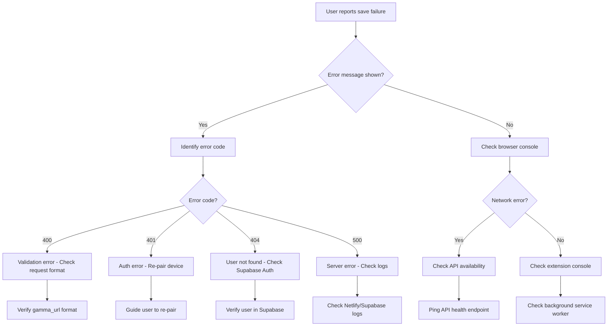

# Troubleshooting Guide: Presentation Save Issues

**Last Updated:** October 2025 (Sprint 38)
**Audience:** Developers and Support Team

---

## Table of Contents

1. [Quick Diagnostics](#quick-diagnostics)
2. [Common Error Codes](#common-error-codes)
3. [Known Issues](#known-issues)
4. [Debugging Workflows](#debugging-workflows)
5. [Emergency Procedures](#emergency-procedures)

---

## Quick Diagnostics

### Issue: "Failed to save presentation"

#### Step 1: Check Extension Environment

**Verify Extension Configuration:**
```javascript
// Open extension background page console
chrome://extensions → Toggle Developer Mode →
  Click "Inspect views: background page" under extension

// In console, check API endpoint
console.log(environment.apiBaseUrl)

// Expected outputs:
// Local build:  http://localhost:3000
// Production:   https://productory-powerups.netlify.app
```

**Check Extension Version:**
- Chrome → Extensions → Look for "Productory Powerups"
- Version should match latest release (check `manifest.production.json`)

#### Step 2: Verify Authentication

**Check Device Token Cookie:**
```
1. Navigate to chrome://settings/cookies
2. Search for "productory-powerups.netlify.app"
3. Look for "device-token" cookie
4. Verify:
   - ✅ Cookie exists
   - ✅ Not expired
   - ✅ Has valid value (long alphanumeric string)
```

**Test Token Validity:**
```bash
# Get token from extension storage (DevTools → Application → Extension Storage)
TOKEN="<your-device-token>"

# Test token validation directly
curl -X POST 'http://localhost:3000/api/presentations/save' \
  -H "Authorization: Bearer $TOKEN" \
  -H 'Content-Type: application/json' \
  -d '{
    "gamma_url": "https://gamma.app/docs/test-123e4567-e89b-12d3-a456-426614174000",
    "title": "Test Presentation",
    "timetable_data": {"title":"Test","items":[]}
  }'

# Expected responses:
# 200 OK: Token valid, save successful
# 400 Bad Request: Invalid gamma_url format (expected - proves API works)
# 401 Unauthorized: Token invalid/expired → Re-pair device
# 500 Internal Error: Database/RPC issue → Check logs
```

#### Step 3: Test API Endpoint

**Verify API is Running:**
```bash
# Ping health check (if available)
curl https://productory-powerups.netlify.app/api/health

# Or test save endpoint with minimal data
curl -X POST 'https://productory-powerups.netlify.app/api/presentations/save' \
  -H 'Content-Type: application/json' \
  -d '{"gamma_url":"https://gamma.app/docs/test","title":"Test"}'

# Expected: 401 Unauthorized (proves endpoint exists and auth works)
# If timeout: Netlify function not deployed
# If 404: URL incorrect or function not configured
```

#### Step 4: Check Database

**Verify RPC Function Exists:**
```bash
# Using Supabase CLI
supabase functions list | grep rpc_upsert_presentation_from_device

# Or query directly in Supabase Dashboard → SQL Editor
SELECT routine_name, routine_type
FROM information_schema.routines
WHERE routine_name = 'rpc_upsert_presentation_from_device';

# Expected: 1 row with routine_type = 'FUNCTION'
# If empty: Migration not applied → Run `supabase db push`
```

**Test RPC Directly:**
```sql
-- In Supabase SQL Editor
SELECT * FROM rpc_upsert_presentation_from_device(
  '123e4567-e89b-12d3-a456-426614174000'::uuid,  -- p_auth_id
  'https://gamma.app/docs/test-123e4567-e89b-12d3-a456-426614174000',  -- p_gamma_url
  'Test Title',  -- p_title
  '{"title":"Test","items":[]}'::jsonb,  -- p_timetable_data
  '09:00',  -- p_start_time
  60,  -- p_total_duration
  'test@example.com'  -- p_email
);

-- Expected: 1 row returned with presentation data
-- If error: Check error message for specifics
```

---

## Common Error Codes

| HTTP Status | Error Code | Meaning | Root Cause | Solution |
|-------------|-----------|---------|------------|----------|
| **400** | VALIDATION_ERROR | Invalid request body | Malformed JSON, missing required fields | Validate gamma_url format: `https://gamma.app/docs/{uuid}` |
| **400** | - | Bad gamma_url format | URL doesn't match expected pattern | Check URL is valid gamma.app presentation link |
| **401** | - | Missing/invalid auth token | Device token expired or not sent | Re-pair device via extension settings |
| **404** | P0001 | User not found | auth_id doesn't exist in auth.users | Re-authenticate user, check Supabase Auth logs |
| **500** | 22004 | auth_id is null | Device token returned null user_id | Check device_tokens table, verify token hash |
| **500** | DATABASE_ERROR | RPC execution failed | Database constraint violation | Check Supabase logs, verify UUID formats |
| **500** | - | Unexpected error | Unhandled exception in API | Check Netlify function logs for stack trace |

### Error Code Details

#### VALIDATION_ERROR (400)
```json
{
  "code": "VALIDATION_ERROR",
  "message": "Invalid body",
  "details": [
    {
      "path": ["gamma_url"],
      "message": "Invalid URL format"
    }
  ]
}
```

**Common Causes:**
- gamma_url missing or not a string
- timetable_data not valid JSON
- title missing or empty

**Fix:**
```javascript
// Correct request format
const payload = {
  gamma_url: "https://gamma.app/docs/123e4567-e89b-12d3-a456-426614174000",  // Must be gamma.app URL
  title: "My Presentation",  // Required, non-empty
  timetable_data: {  // Required, valid JSON
    title: "Presentation Title",
    items: [...]
  },
  start_time: "09:00",  // Optional
  total_duration: 3600  // Optional (seconds)
};
```

#### P0001 - User Not Found (404)
```json
{
  "error": "Failed to save presentation",
  "debug": {
    "code": "P0001",
    "message": "User not found",
    "details": "auth_id does not exist in auth.users"
  }
}
```

**Root Cause:** Device token references a user that was deleted from Supabase Auth

**Fix:**
1. Check if user exists: Supabase Dashboard → Authentication → Users
2. If deleted: User must re-register and re-pair device
3. If exists: Check auth_id mismatch → Verify device_tokens.user_id matches auth.users.id

#### 22004 - auth_id is null (500)
```json
{
  "error": "Failed to save presentation",
  "debug": {
    "code": "22004",
    "message": "auth_id is required"
  }
}
```

**Root Cause:** Device token validation returned null user_id

**Debugging Steps:**
```sql
-- 1. Check device token in database
SELECT user_id, user_email, expires_at, revoked
FROM device_tokens
WHERE token = digest('raw-token-here', 'sha256');

-- 2. Verify token not expired
SELECT NOW() > expires_at AS is_expired
FROM device_tokens
WHERE token = digest('raw-token-here', 'sha256');

-- 3. Check revocation status
SELECT revoked FROM device_tokens
WHERE token = digest('raw-token-here', 'sha256');
```

**Fix:**
- If expired: User must re-pair device
- If revoked: Admin revoked token → User must re-authenticate
- If user_id null: Data corruption → Delete token row, re-pair device

---

## Known Issues

### Issue: Extension shows "saved" but data missing in dashboard

**Symptoms:**
- Extension sidebar shows success message
- Dashboard doesn't display saved presentation
- No error in browser console

**Root Cause:** Silent failure in cloud sync due to network error or CORS issue

**Debugging:**
```javascript
// Check browser Network tab
// Filter: /api/presentations/save
// Look for:
// - Request status (should be 200 OK)
// - Response body (should have success: true)
// - CORS errors (check preflight OPTIONS request)
```

**Fix:**
1. Check browser console for network errors
2. Verify CORS headers in API response
3. Test save with DevTools Network tab open
4. If still failing: Check Netlify function logs

**Workaround:** Manually refresh dashboard page

---

### Issue: Local development not working

**Symptoms:**
- Extension built with `npm run build:local`
- Save requests fail with connection refused
- API shows as unavailable

**Root Cause:** Extension built for wrong environment or local server not running

**Fix:**
```bash
# 1. Verify local server is running
PORT=3000 npm run dev

# Server should output:
# ✓ Ready on http://localhost:3000

# 2. Rebuild extension for local env
npm run build:local

# 3. Reload extension in Chrome
chrome://extensions → Click reload icon

# 4. Verify environment in background console
// Should show: http://localhost:3000
console.log(environment.apiBaseUrl)
```

**Common Mistakes:**
- Running `npm run build` instead of `npm run build:local`
- Forgetting to reload extension after rebuild
- Local server not running on port 3000
- Firewall blocking localhost connections

---

### Issue: Pairing code expires before entry

**Symptoms:**
- User generates pairing code in web app
- Switches to extension to enter code
- Extension shows "Invalid or expired code"

**Root Cause:** Pairing codes expire after 5 minutes (security measure)

**Fix:**
1. Keep both web app and extension open side-by-side
2. Generate code and immediately enter in extension
3. If code expires: Generate new code

**Future Improvement:** Increase pairing code TTL to 10 minutes (out of scope for Sprint 38)

---

## Debugging Workflows

### Workflow 1: User Can't Save Presentation



### Workflow 2: Database Migration Issues

```bash
# 1. Check migration status
supabase migration list

# Output shows:
# Local version | Remote version | Migration
# Applied       | Applied        | 20251004101500_update_presentations_rpc_auth_sync.sql
# Pending       | -              | 20251005120000_new_migration.sql

# 2. Repair migration history (if out of sync)
supabase migration repair --status reverted <migration_version>

# 3. Apply pending migrations
supabase db push --linked --include-all

# 4. Validate deployment
supabase db execute "SELECT routine_name FROM information_schema.routines WHERE routine_name LIKE 'rpc_%'"

# 5. Test RPC directly (see Step 4 in Quick Diagnostics)
```

### Workflow 3: Netlify Function Debugging

```bash
# 1. Check function logs in Netlify Dashboard
# Navigate to: Dashboard → Functions → /api/presentations/save
# Look for recent invocations with errors

# 2. Check deployment status
netlify status

# 3. Manually trigger function for testing
curl -X POST 'https://productory-powerups.netlify.app/api/presentations/save' \
  -H 'Content-Type: application/json' \
  -H 'Authorization: Bearer <test-token>' \
  -d '{"gamma_url":"https://gamma.app/docs/test","title":"Test"}' \
  -v

# 4. Check response headers for debug info
# Look for:
# - X-Debug-Code: Error code from function
# - Cache-Control: Should be no-cache for API routes
# - Access-Control-Allow-Origin: CORS headers
```

---

## Emergency Procedures

### Emergency Rollback (Production Issues)

**When to Rollback:**
- Critical save failures affecting all users
- Database corruption detected
- Security vulnerability discovered

**Rollback Steps:**

```bash
# 1. Identify last known good commit
git log --oneline -10

# Sample output:
# 44af98c Production ready: security hardening and console cleanup
# 586afc0 ROLLBACK: Revert to Sprint 35 - Remove all Sprint 36 changes
# 5f4d145 fix: exchange_device_code must use API's raw_token

# 2. Revert to last stable commit (44af98c from Sprint 37)
git revert HEAD --no-edit
git push origin main

# Netlify will auto-deploy reverted version

# 3. Or hard reset (if git revert fails)
git reset --hard 44af98c
git push --force origin main

# ⚠️ WARNING: Force push overwrites history - use with caution

# 4. Rebuild and redeploy extension
npm run build
# Manually upload to Chrome Web Store

# 5. Rollback database migrations (if needed)
supabase migration repair --status reverted <migration_version>
```

**Post-Rollback Checklist:**
- [ ] Verify production save flow works
- [ ] Check Netlify deployment status
- [ ] Monitor error rates in logs
- [ ] Notify users of downtime/resolution
- [ ] Document root cause and fix in sprint retrospective

---

### Database Emergency: RPC Fails to Execute

**Symptoms:**
- All save requests return 500 errors
- RPC error code P0001 or 22004
- Supabase logs show function execution errors

**Immediate Actions:**

```sql
-- 1. Verify RPC permissions
SELECT routine_name, grantee, privilege_type
FROM information_schema.routine_privileges
WHERE routine_name = 'rpc_upsert_presentation_from_device';

-- Expected: anon and authenticated should have EXECUTE

-- 2. Re-grant permissions if missing
GRANT EXECUTE ON FUNCTION rpc_upsert_presentation_from_device(uuid, text, text, jsonb, text, integer, text)
  TO anon, authenticated;

-- 3. Test RPC with sample data
SELECT * FROM rpc_upsert_presentation_from_device(
  '123e4567-e89b-12d3-a456-426614174000'::uuid,
  'https://gamma.app/docs/test',
  'Test Title',
  '{"title":"Test"}'::jsonb,
  '09:00',
  60,
  'test@example.com'
);

-- 4. If RPC missing: Re-apply migration
-- Download migration from git history
-- Run: supabase db push --linked --include-all
```

**Recovery Plan:**
1. **Immediate:** Disable affected feature in extension (show maintenance mode)
2. **Short-term:** Re-apply migration or restore from backup
3. **Long-term:** Add monitoring alerts for RPC failures

---

### Extension Store Emergency (Malicious Code Detected)

**If Chrome Web Store flags extension:**

**Immediate Response:**
```bash
# 1. Pull extension from store (if possible)
# Contact Chrome Web Store support immediately

# 2. Audit codebase for malicious code
git log --all --source --full-history -- '*.js' '*.ts'

# 3. Scan for suspicious patterns
grep -r "eval(" packages/extension/
grep -r "innerHTML" packages/extension/
grep -r "fetch.*http:" packages/extension/

# 4. Review permissions in manifest
cat packages/extension/manifest.production.json | jq '.permissions'

# Expected: ["storage", "activeTab"]
# Unexpected: ["tabs", "<all_urls>", "webRequest"]
```

**Remediation:**
1. Identify and remove malicious code
2. Security audit of entire codebase
3. Increment version number
4. Resubmit clean build to Chrome Web Store
5. Force update for all users (if critical)

---

## Diagnostic Commands Cheat Sheet

```bash
# Extension Debugging
chrome://extensions                    # View installed extensions
chrome://extensions → Background Page  # Open background console
chrome://settings/cookies             # View cookies

# API Testing
curl -X POST <api-url>/save           # Test save endpoint
curl -X OPTIONS <api-url>/save        # Test CORS preflight

# Database
supabase migration list               # Check migration status
supabase db push --linked             # Deploy migrations
supabase logs --type api              # View API logs
supabase logs --type db               # View database logs

# Netlify
netlify status                        # Check deployment status
netlify functions:list                # List deployed functions
netlify logs functions                # View function logs

# Git
git log --oneline -10                 # Recent commits
git diff HEAD^ HEAD                   # Compare last commit
git revert HEAD                       # Revert last commit
```

---

## Support Escalation

### Level 1: User Self-Service
- Check this troubleshooting guide
- Re-pair device
- Refresh browser/extension
- Try in incognito mode

### Level 2: Developer Investigation
- Check Netlify function logs
- Verify Supabase RPC execution
- Test with curl/Postman
- Review browser console errors

### Level 3: Infrastructure Team
- Database migration issues
- Netlify deployment failures
- Supabase outages
- DNS/CORS configuration

### Level 4: Emergency Response
- Security incidents
- Data corruption
- Complete service outage
- Chrome Web Store violations

**Escalation Contacts:**
- Developer Team: [GitHub Issues](https://github.com/your-org/gamma-plugin/issues)
- Infrastructure: [Slack #infrastructure]
- Security: [security@yourcompany.com]

---

**Document Maintained By:** Development Team
**Review Cycle:** After each major incident
**Last Incident:** October 3, 2025 (500 errors - resolved in Sprint 37)
