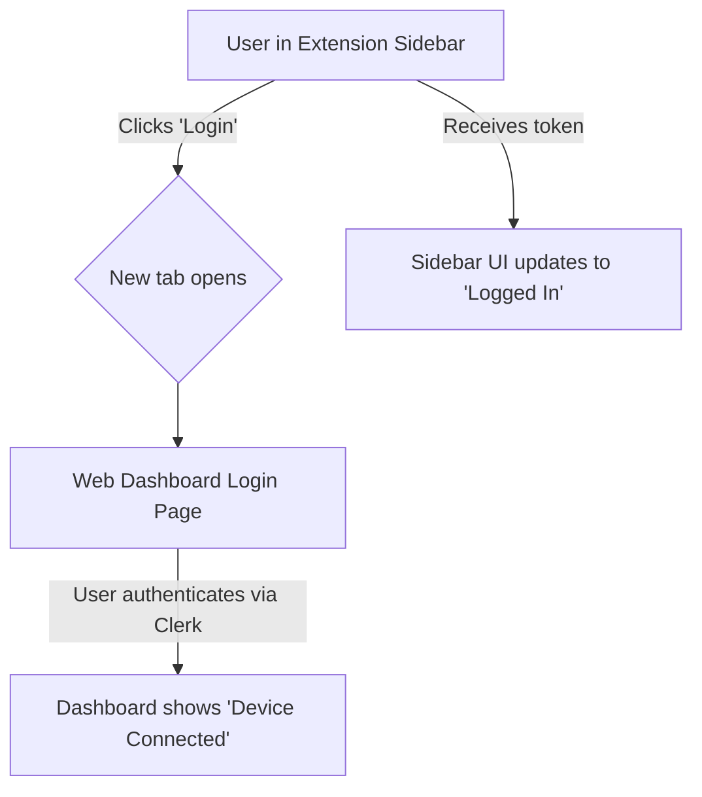
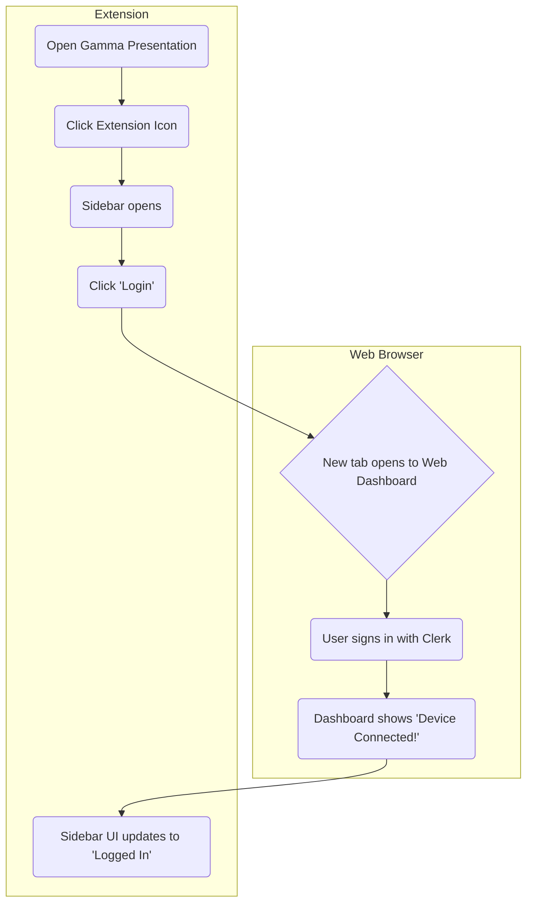
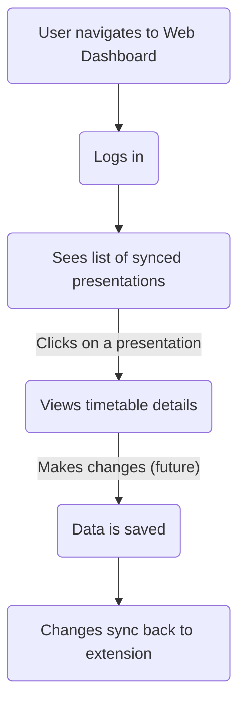

# UI/UX Design Specification: Gamma Timetable Chrome Extension

## 1. Design Overview

### Design Philosophy

- **Minimalist**: Clean interface that doesn't overwhelm
- **Intuitive**: Self-explanatory controls and flow
- **Efficient**: Quick access to all features
- **Consistent**: Follows Chrome extension patterns

### Visual Style

- Modern, clean aesthetic
- Matches Gamma's design language where appropriate
- Support for light/dark themes
- Accessible color contrasts

## 2. User Interface Components

### 2.1 Authentication & Onboarding

#### Web-First Login Flow

The primary user authentication journey begins in the extension and transitions to the web dashboard.



#### Web Dashboard - Device Pairing UI

```
┌──────────────────────────────────────────┐
│  ✅ Device Connected Successfully!       │
│                                          │
│  You can now close this tab and return   │
│  to your Gamma presentation.             │
│                                          │
│  Your timetables will now be securely    │
│  synced to your account.                 │
│                                          │
└──────────────────────────────────────────┘
```

### 2.2 Extension Icon

```
States:
- Default: Grey icon (inactive)
- Active: Colored icon (when on gamma.app)
- Badge: Shows slide count when detected
```

### 2.3 Popup Menu

```
┌─────────────────────────┐
│  Gamma Timetable        │
├─────────────────────────┤
│  📊 Open Sidebar        │
│  ⚙️ Settings            │
│  ❓ Help                │
│  ──────────────────     │
│  Status: Ready          │
│  Slides: 24 detected    │
└─────────────────────────┘
```

### 2.4 Sidebar Panel

#### Logged-Out State

```
┌──────────────────────────────────────┐
│  🕐 Course Timetable          [✕]   │
├──────────────────────────────────────┤
│  [Login or Sign Up] to sync          │
│  your timetables across devices.     │
├──────────────────────────────────────┤
│  Presentation: [Title]               │
│  Total Duration: 1h 45m              │
├──────────────────────────────────────┤
│  Timeline (Local only)               │
│  ...                                 │
├──────────────────────────────────────┤
│  [Export ▼] (Local)                  │
└──────────────────────────────────────┘
```

#### Logged-In State

```
┌──────────────────────────────────────┐
│  🕐 Course Timetable          [✕]   │
├──────────────────────────────────────┤
│  👤 Logged in as: user@email.com     │
│  ☁️ Synced to cloud                  │
├──────────────────────────────────────┤
│  Presentation: [Title]               │
│  Total Duration: 1h 45m              │
├──────────────────────────────────────┤
│  Timeline (Synced)                   │
│  ...                                 │
├──────────────────────────────────────┤
│  [Export ▼] [Logout]                 │
└──────────────────────────────────────┘
```

### 2.5 Web Dashboard

The web dashboard provides a central place for users to manage their presentations and account.

#### Main Dashboard View

```
┌──────────────────────────────────────────────────────────────────────────┐
│  Gamma Timetable Dashboard              [user@email.com ▼] [Logout]      │
├──────────────────────────────────────────────────────────────────────────┤
│  My Presentations                                                        │
├──────────────────────────────────────────────────────────────────────────┤
│                                                                          │
│  ┌───────────────────────────────────┐   ┌───────────────────────────────────┐   │
│  │ 📄 Intro to Marketing        │   │ 📄 Advanced JavaScript       │   │
│  │ Synced: Aug 12, 2025         │   │ Synced: Aug 10, 2025         │   │
│  │ [View Timetable] [Delete]    │   │ [View Timetable] [Delete]    │   │
│  └───────────────────────────────────┘   └───────────────────────────────────┘   │
│                                                                          │
│  ┌───────────────────────────────────┐                                       │
│  │ 📄 Public Speaking 101       │                                       │
│  │ Synced: Aug 9, 2025          │                                       │
│  │ [View Timetable] [Delete]    │                                       │
│  └───────────────────────────────────┘                                       │
│                                                                          │
└──────────────────────────────────────────────────────────────────────────┘
```


## 3. User Flows

### 3.1 First Time Login & Device Pairing



### 3.2 Managing Presentations on Web



## 4. Interactive Elements

### 4.1 Time Duration Controls

```
Design Pattern: Inline Editable Fields
- Click to edit
- Tab to next field
- Enter to confirm
- Esc to cancel
- Up/Down arrows to increment/decrement
```

### 4.2 Drag & Drop Reordering

```
Interaction:
- Hover shows grab cursor
- Drag shows ghost element
- Drop zone highlights
- Smooth animation on drop
```

### 4.3 Break Management

```
Add Break Button:
- Shows between any two items on hover
- Click inserts break with default duration
- Break items are visually distinct

Break Item:
- Different background color
- Can be deleted with X button
- Duration editable like slides
```

## 5. Visual Design System

### 5.1 Color Palette

```css
/* Light Theme */
--primary: #2563eb; /* Blue - Actions */
--secondary: #64748b; /* Grey - Secondary text */
--success: #10b981; /* Green - Success states */
--warning: #f59e0b; /* Amber - Warnings */
--danger: #ef4444; /* Red - Errors */
--background: #ffffff; /* White - Main bg */
--surface: #f8fafc; /* Light grey - Cards */
--text: #1e293b; /* Dark - Primary text */
--border: #e2e8f0; /* Light - Borders */

/* Dark Theme */
--primary-dark: #3b82f6;
--background-dark: #0f172a;
--surface-dark: #1e293b;
--text-dark: #f1f5f9;
--border-dark: #334155;
```

### 5.2 Typography

```css
/* Font Stack */
font-family:
  -apple-system, BlinkMacSystemFont, 'Segoe UI', Roboto, Oxygen, Ubuntu, Cantarell, sans-serif;

/* Type Scale */
--text-xs: 0.75rem; /* 12px - Labels */
--text-sm: 0.875rem; /* 14px - Body */
--text-base: 1rem; /* 16px - Default */
--text-lg: 1.125rem; /* 18px - Headings */
--text-xl: 1.25rem; /* 20px - Title */
```

### 5.3 Spacing System

```css
/* Spacing Scale */
--space-1: 0.25rem; /* 4px */
--space-2: 0.5rem; /* 8px */
--space-3: 0.75rem; /* 12px */
--space-4: 1rem; /* 16px */
--space-5: 1.25rem; /* 20px */
--space-6: 1.5rem; /* 24px */
```

## 6. Component Specifications

### 6.1 Timetable Item Component

```html
<div class="timetable-item" data-id="slide-1">
  <div class="time-column">
    <span class="start-time">09:00</span>
  </div>
  <div class="content-column">
    <h4 class="item-title">Introduction to AI</h4>
    <p class="item-description">Overview of artificial intelligence concepts</p>
  </div>
  <div class="duration-column">
    <input type="number" class="duration-input" value="10" min="1" max="180" />
    <span class="duration-unit">min</span>
  </div>
  <div class="actions-column">
    <button class="drag-handle" aria-label="Reorder">⋮⋮</button>
  </div>
</div>
```

### 6.2 Export Menu Component

```html
<div class="export-menu">
  <button class="export-button">Export <span class="arrow">▼</span></button>
  <div class="export-dropdown">
    <a href="#" class="export-option" data-format="csv">
      <span class="icon">📄</span> Export as CSV
    </a>
    <a href="#" class="export-option" data-format="excel">
      <span class="icon">📊</span> Export as Excel
    </a>
    <a href="#" class="export-option" data-format="pdf">
      <span class="icon">📑</span> Export as PDF
    </a>
    <hr />
    <a href="#" class="export-option" data-format="clipboard">
      <span class="icon">📋</span> Copy to Clipboard
    </a>
  </div>
</div>
```

## 7. Responsive Behavior

### 7.1 Sidebar Width Adaptation

- Minimum width: 320px
- Maximum width: 480px
- Resizable by user (saved preference)
- Content reflows appropriately

### 7.2 Scrolling Behavior

- Fixed header with title and total duration
- Fixed footer with action buttons
- Middle section scrolls
- Smooth scroll animations
- Scroll indicators for long lists

## 8. Accessibility Features

### 8.1 Keyboard Navigation

- Tab through all interactive elements
- Arrow keys for time adjustment
- Space/Enter to activate buttons
- Escape to close menus
- Focus indicators visible

### 8.2 Screen Reader Support

- Proper ARIA labels
- Role attributes
- Live regions for updates
- Descriptive button text

### 8.3 Visual Accessibility

- 4.5:1 contrast ratio minimum
- No color-only indicators
- Clear focus states
- Sufficient touch targets (44x44px)

## 9. Micro-interactions

### 9.1 Loading States

```
Extraction in progress:
- Pulsing animation on icon
- Progress indicator in sidebar
- "Extracting slides..." message
```

### 9.2 Success Feedback

```
After successful export:
- Green checkmark animation
- "Exported successfully" toast
- Auto-dismiss after 3 seconds
```

### 9.3 Error States

```
When extraction fails:
- Red error icon
- Clear error message
- Retry button
- Help link
```

## 10. Empty States

### 10.1 No Presentation Detected

```
┌──────────────────────────────────────┐
│         No Presentation Found        │
│                                      │
│            🎯                        │
│                                      │
│   Open a Gamma presentation to      │
│   start creating your timetable     │
│                                      │
│        [Open Gamma.app]              │
└──────────────────────────────────────┘
```

### 10.2 No Slides Extracted

```
┌──────────────────────────────────────┐
│         No Slides Detected           │
│                                      │
│            📊                        │
│                                      │
│   Could not extract slides from      │
│   this presentation.                 │
│                                      │
│   [Try Again]  [Get Help]            │
└──────────────────────────────────────┘
```

## 11. Animation Guidelines

### 11.1 Transition Durations

- Micro animations: 150ms
- Page transitions: 300ms
- Loading animations: 500ms
- Use ease-out curves

### 11.2 Animation Types

- Fade in/out for overlays
- Slide for panels
- Scale for buttons
- Smooth color transitions

## 12. Design Patterns

### 12.1 Inline Editing Pattern

- Single click to select
- Double click to edit
- Visual mode change
- Clear save/cancel options

### 12.2 Progressive Disclosure

- Basic settings visible
- Advanced options collapsed
- Clear expand/collapse indicators
- Remember user preferences

### 12.3 Contextual Actions

- Actions appear on hover
- Right-click menus where appropriate
- Tooltips for unclear icons
- Confirmation for destructive actions

---

_Document Version: 1.0_  
_Last Updated: [Current Date]_  
_Status: Draft_
