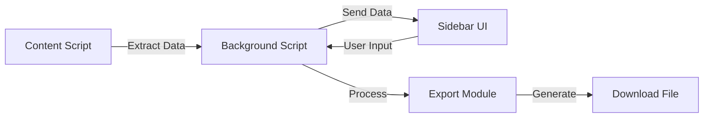

# Development Brief: Gamma Timetable Chrome Extension

## 1. Project Overview

### Project Name

Gamma Timetable Chrome Extension

### Project Description

A Chrome browser extension that extracts slide content from Gamma presentations and generates customizable timetables for educators, trainers, and presenters.

### Development Timeline

- **Phase 1 (MVP)**: 4-6 weeks
- **Phase 2 (v1.1)**: 2-3 weeks
- **Phase 3 (Future)**: Ongoing

### Tech Stack

- **Frontend**: HTML5, CSS3, JavaScript/TypeScript
- **Framework**: Vanilla JS or lightweight framework (Preact/Alpine.js)
- **Build Tools**: Webpack/Vite, TypeScript compiler
- **Testing**: Jest, Puppeteer
- **Version Control**: Git/GitHub

## 2. Architecture Overview

### Extension Components

```
gamma-timetable-extension/
├── manifest.json           # Extension manifest (V3)
├── src/
│   ├── background/        # Background service worker
│   │   └── background.ts
│   ├── content/          # Content scripts
│   │   ├── extractor.ts  # DOM extraction logic
│   │   └── injector.ts   # UI injection
│   ├── sidebar/          # Sidebar UI
│   │   ├── sidebar.html
│   │   ├── sidebar.ts
│   │   └── sidebar.css
│   ├── popup/            # Extension popup
│   │   ├── popup.html
│   │   └── popup.ts
│   ├── core/             # Core business logic
│   │   ├── parser.ts
│   │   ├── timeCalculator.ts
│   │   └── exporter.ts
│   └── utils/            # Utility functions
│       ├── storage.ts
│       └── messaging.ts
├── assets/               # Icons and images
├── styles/              # Global styles
├── tests/               # Test files
└── build/               # Build output
```

### Component Communication



## 3. Technical Specifications

### 3.1 Content Script Implementation

```typescript
// extractor.ts - Core extraction logic
interface SlideData {
  id: string;
  title: string;
  content: string[];
  order: number;
  level: number;
}

class GammaExtractor {
  private slides: SlideData[] = [];

  extractSlides(): SlideData[] {
    // DOM parsing logic
    const slideElements = document.querySelectorAll('[data-slide-id]');
    return Array.from(slideElements).map(this.parseSlide);
  }

  private parseSlide(element: Element): SlideData {
    // Extract title, content, hierarchy
    return {
      id: element.getAttribute('data-slide-id') || '',
      title: this.extractTitle(element),
      content: this.extractContent(element),
      order: this.getSlideOrder(element),
      level: this.getHierarchyLevel(element),
    };
  }
}
```

### 3.2 Sidebar UI Framework

```typescript
// sidebar.ts - UI component structure
class TimetableUI {
  private container: HTMLElement;
  private items: TimetableItem[] = [];

  constructor(container: HTMLElement) {
    this.container = container;
    this.initializeUI();
  }

  renderTimetable(slides: SlideData[]): void {
    this.items = slides.map(slide => new TimetableItem(slide));
    this.updateDisplay();
  }

  private initializeUI(): void {
    // Create UI structure
    this.container.innerHTML = `
      <div class="timetable-header">
        <h2>Course Timetable</h2>
        <button id="export-btn">Export</button>
      </div>
      <div class="timetable-settings">
        <input type="time" id="start-time" />
        <input type="number" id="default-duration" />
      </div>
      <div class="timetable-items"></div>
    `;
  }
}
```

### 3.3 Data Models

```typescript
// models.ts
interface Presentation {
  title: string;
  totalSlides: number;
  extractedAt: Date;
}

interface TimetableItem {
  id: string;
  title: string;
  content: string[];
  duration: number; // in minutes
  startTime: string; // HH:MM format
  endTime: string;
  type: 'slide' | 'break';
  children?: TimetableItem[];
}

interface TimetableSettings {
  defaultDuration: number;
  startTime: string;
  breakDuration: number;
  timeFormat: '12h' | '24h';
}
```

## 4. Implementation Plan

### Phase 1: MVP Development (Weeks 1-6)

#### Week 1-2: Foundation

- [ ] Project setup and configuration
- [ ] Manifest V3 implementation
- [ ] Basic content script structure
- [ ] Communication pipeline setup

#### Week 3-4: Core Features

- [ ] DOM extraction algorithm
- [ ] Sidebar UI implementation
- [ ] Time calculation logic
- [ ] Basic CSV export

#### Week 5-6: Integration & Testing

- [ ] Component integration
- [ ] Error handling
- [ ] Performance optimization
- [ ] Beta testing

### Phase 2: Enhanced Features (Weeks 7-9)

#### Week 7-8: Additional Features

- [ ] Break management
- [ ] Multiple export formats
- [ ] Time templates
- [ ] UI improvements

#### Week 9: Polish & Release

- [ ] Bug fixes from beta feedback
- [ ] Documentation
- [ ] Chrome Web Store submission
- [ ] Marketing materials

## 5. Technical Challenges & Solutions

### Challenge 1: DOM Structure Variations

**Problem**: Gamma may update their DOM structure
**Solution**:

- Implement flexible selectors
- Use multiple fallback strategies
- Add DOM structure detection

### Challenge 2: Performance with Large Presentations

**Problem**: Extracting 100+ slides may be slow
**Solution**:

- Implement lazy loading
- Use web workers for processing
- Chunk extraction process

### Challenge 3: Sidebar Space Constraints

**Problem**: Limited width for complex UI
**Solution**:

- Collapsible sections
- Compact time controls
- Tooltip information

## 6. Testing Strategy

### 6.1 Unit Testing

```javascript
// Example test for time calculator
describe('TimeCalculator', () => {
  test('calculates end time correctly', () => {
    const calculator = new TimeCalculator();
    const result = calculator.calculateEndTime('09:00', 45);
    expect(result).toBe('09:45');
  });
});
```

### 6.2 Integration Testing

- Test with sample Gamma presentations
- Verify extraction accuracy
- Test export functionality
- Performance benchmarks

### 6.3 User Testing

- Beta group of 20-30 users
- Feedback surveys
- Usage analytics
- Bug reporting system

## 7. Security Considerations

### Permissions Required

```json
{
  "permissions": ["activeTab", "storage", "downloads"],
  "host_permissions": ["https://gamma.app/*"]
}
```

### Security Measures

- Content Security Policy implementation
- Input sanitization
- No external API calls
- Secure storage practices

## 8. Performance Optimization

### Extraction Optimization

- Batch DOM queries
- Use efficient selectors
- Minimize reflows
- Cache extracted data

### UI Optimization

- Virtual scrolling for long lists
- Debounced input handlers
- Efficient re-rendering
- Minimal CSS animations

## 9. Deployment Strategy

### Chrome Web Store Submission

1. **Preparation**
   - Privacy policy creation
   - Store listing content
   - Screenshots and demo video
   - Detailed description

2. **Review Process**
   - Initial submission
   - Address review feedback
   - Version updates

### Version Management

- Semantic versioning (MAJOR.MINOR.PATCH)
- Automated build process
- Release notes generation
- Update notifications

## 10. Post-Launch Plan

### Monitoring

- Error tracking (Sentry integration)
- Usage analytics (privacy-respecting)
- Performance monitoring
- User feedback collection

### Maintenance

- Regular compatibility checks
- Bug fix releases
- Feature updates based on feedback
- Documentation updates

### Growth Strategy

- Content marketing (tutorials, blog posts)
- Community engagement
- Feature request tracking
- Potential API partnerships

## 11. Resource Requirements

### Development Team

- **Lead Developer**: Full-stack JavaScript
- **UI/UX Designer**: Extension interface design
- **QA Tester**: Testing and feedback
- **Technical Writer**: Documentation

### Tools & Services

- GitHub repository
- Chrome Developer account ($5 one-time)
- Testing devices/VMs
- Design tools (Figma/Sketch)

## 12. Risk Mitigation

### Technical Risks

| Risk                | Impact | Mitigation                      |
| ------------------- | ------ | ------------------------------- |
| Gamma DOM changes   | High   | Robust selectors, quick updates |
| Performance issues  | Medium | Optimization, lazy loading      |
| Browser API changes | Low    | Stay updated with Chrome docs   |

### Business Risks

| Risk           | Impact | Mitigation                      |
| -------------- | ------ | ------------------------------- |
| Low adoption   | Medium | Marketing, user education       |
| Competition    | Low    | Unique features, fast iteration |
| Support burden | Medium | Good documentation, FAQ         |

---

_Document Version: 1.0_  
_Last Updated: [Current Date]_  
_Status: Draft_
