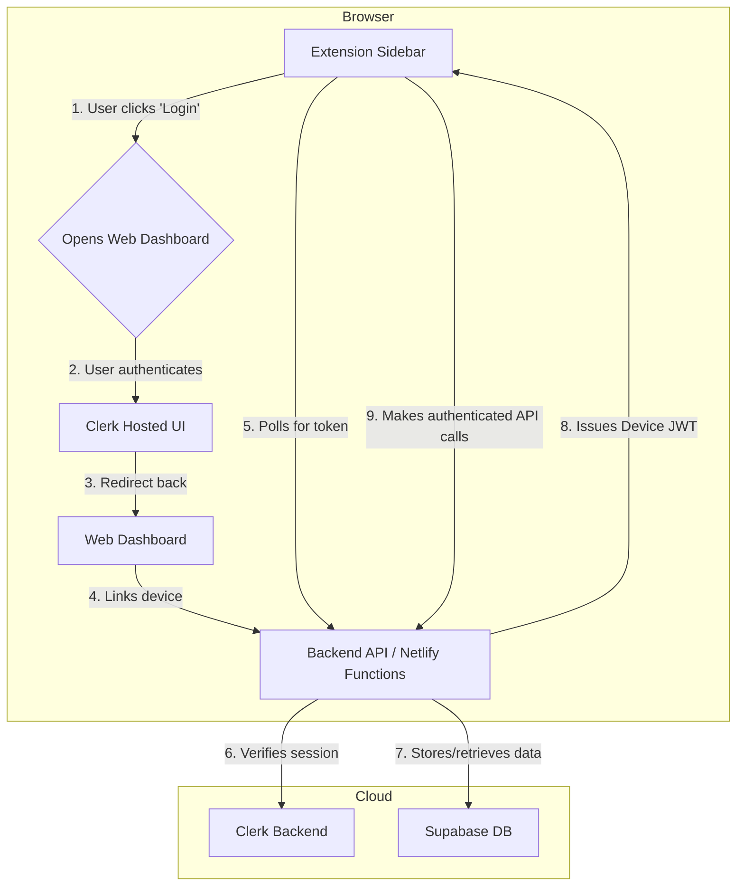

# Development Brief: Gamma Timetable Chrome Extension

## 1. Project Overview

### Project Name

Gamma Timetable Chrome Extension

### Project Description

A Chrome browser extension that extracts slide content from Gamma presentations and generates customizable timetables for educators, trainers, and presenters.

### Development Timeline

- **Phase 1 (MVP)**: 4-6 weeks
- **Phase 2 (v1.1)**: 2-3 weeks
- **Phase 3 (Future)**: Ongoing

### Tech Stack

- **Frontend**: TypeScript, HTML5, CSS3
- **Backend**: Node.js (Netlify Functions)
- **Frameworks/Libraries**:
    - **Web Dashboard**: Vite
    - **Authentication**: Clerk
    - **Database**: Supabase (PostgreSQL)
- **Build Tools**: Vite, TypeScript compiler, ESLint, Prettier
- **Testing**: Vitest, Playwright (for E2E)
- **Deployment**:
    - **Web Dashboard & Functions**: Netlify
    - **Chrome Extension**: Chrome Web Store
- **Version Control**: Git/GitHub

## 2. Architecture Overview

The project is a monorepo composed of three main packages: `extension`, `web`, and `shared`. It follows a cloud-native architecture, leveraging serverless functions for the backend and a managed database.

### Monorepo Structure

```
gamma-plugin/
├── packages/
│   ├── extension/      # The Chrome Extension
│   │   ├── manifest.json
│   │   └── ...
│   ├── web/            # The Web Dashboard
│   │   ├── index.html
│   │   └── src/main.js
│   └── shared/         # Shared code (types, config, auth logic)
│       └── index.ts
├── netlify/
│   └── functions/      # Serverless backend functions
│       ├── devices-link.ts
│       └── ...
├── supabase/
│   └── migrations/     # Database schema migrations
└── ...
```

### Component Communication

The system enables a "web-first" authentication flow, where the extension pairs with an authenticated web session.




## 3. Technical Specifications

### 3.1 Device Pairing Flow (Web-First Authentication)

The core of the new architecture is a secure device pairing flow that links the browser extension to a user's account without requiring the user to log in directly within the extension.

```typescript
// packages/shared/auth/device.ts - Simplified device authentication logic

// 1. Extension registers itself with the backend
async function registerDevice(): Promise<PairingInfo> {
  const response = await fetch(`${API_BASE_URL}/devices/register`, { method: 'POST' });
  const data = await response.json();
  // returns { deviceId, code, expiresAt }
  return data;
}

// 2. Web dashboard, after user logs in, links the device
async function linkDevice(code: string, userToken: string): Promise<void> {
  await fetch(`${API_BASE_URL}/devices/link`, {
    method: 'POST',
    headers: { 'Authorization': `Bearer ${userToken}` },
    body: JSON.stringify({ code }),
  });
}

// 3. Extension polls to exchange its pairing code for a device-specific JWT
async function exchangeCodeForToken(deviceId: string, code: string): Promise<DeviceToken> {
    const response = await fetch(`${API_BASE_URL}/devices/exchange`, {
    method: 'POST',
    body: JSON.stringify({ deviceId, code }),
  });
  const data = await response.json();
  // returns { token, expiresAt }
  return data;
}
```

### 3.2 Backend API (Netlify Function)

The backend consists of serverless functions. The `devices-link` function is a good example of a protected endpoint.

```typescript
// netlify/functions/devices-link.ts - Simplified link function
import { verifyRequest } from '@clerk/backend';

export default async (req: Request) => {
  // Clerk authenticates the user from the web dashboard's request
  const { session } = await verifyRequest({ req });
  if (!session) {
    return new Response('Unauthorized', { status: 401 });
  }

  const { code } = await req.json();
  // Logic to find device by `code` and associate `session.userId`
  await linkDeviceToUser(code, session.userId);

  return new Response('Device linked successfully', { status: 200 });
};
```

### 3.3 Data Models

The data models are now centered around users, their presentations, and their connected devices.

```typescript
// packages/shared/types/index.ts

// Represents a user account, managed by Clerk
interface User {
  id: string; // e.g., 'user_2ABC...'
  email: string;
  // other profile data
}

// Represents a presentation and its timetable data, linked to a user
interface Presentation {
  id: string;
  userId: string;
  title: string;
  gammaUrl: string;
  timetableData: TimetableItem[];
  createdAt: Date;
  updatedAt: Date;
}

// Represents a browser extension instance that has been paired to a user account
interface Device {
  id: string; // A unique ID for the extension instance
  userId: string;
  createdAt: Date;
  lastSeenAt: Date;
}

// The structure for an item within the timetable
interface TimetableItem {
  id: string;
  title: string;
  duration: number; // in minutes
  // ... other fields
}
```

## 4. Implementation Plan

The project has moved beyond the initial MVP and is now in a phased rollout of its cloud-enabled features.

### Phase 1: Cloud Foundation & Authentication (Complete)

This phase focused on building the backend infrastructure and the user authentication system.

- **Sprint 0: Monorepo & Refactor (Complete)**
  - [x] Restructured project into a monorepo (`packages/`, `netlify/`, `supabase/`).
  - [x] Introduced abstraction layers for storage, config, and auth.
- **Sprint 1: Authentication & Dashboard Shell (Complete)**
  - [x] Implemented the web-first device pairing flow with Clerk.
  - [x] Created the Supabase schema for `users` and `devices`.
  - [x] Built the Netlify functions for the auth backend (`register`, `link`, `exchange`, `refresh`).
  - [x] Developed the web dashboard shell with login/logout capabilities.

### Phase 2: Core Feature Sync & Web Dashboard (In Progress)

This phase focuses on synchronizing presentation and timetable data between the extension and the cloud, and building out the web dashboard.

- **Sprint 2: Presentation Data Sync**
  - [ ] Implement `/api/presentations/save` and `/api/presentations/get` endpoints.
  - [ ] Add presentation sync logic to the extension.
  - [ ] Store timetable data in the Supabase `presentations` table.
- **Sprint 3: Web Dashboard Features**
  - [ ] Display a list of a user's presentations on the web dashboard.
  - [ ] Allow users to view and manage their timetables from the web.
  - [ ] Implement a user profile and device management page.

## 5. Technical Challenges & Solutions

### Challenge 1: DOM Structure Variations

**Problem**: Gamma may update their DOM structure
**Solution**:

- Implement flexible selectors
- Use multiple fallback strategies
- Add DOM structure detection

### Challenge 2: Performance with Large Presentations

**Problem**: Extracting 100+ slides may be slow
**Solution**:

- Implement lazy loading
- Use web workers for processing
- Chunk extraction process

### Challenge 3: Sidebar Space Constraints

**Problem**: Limited width for complex UI
**Solution**:

- Collapsible sections
- Compact time controls
- Tooltip information

## 6. Testing Strategy

### 6.1 Unit Testing

```javascript
// Example test for time calculator
describe('TimeCalculator', () => {
  test('calculates end time correctly', () => {
    const calculator = new TimeCalculator();
    const result = calculator.calculateEndTime('09:00', 45);
    expect(result).toBe('09:45');
  });
});
```

### 6.2 Integration Testing

- Test with sample Gamma presentations
- Verify extraction accuracy
- Test export functionality
- Performance benchmarks

### 6.3 User Testing

- Beta group of 20-30 users
- Feedback surveys
- Usage analytics
- Bug reporting system

## 7. Security Considerations

With the move to a cloud-based backend, security is paramount.

### Permissions Required

The manifest now requires additional permissions for authentication and communication with the backend.

```json
{
  "permissions": [
    "storage",
    "tabs",
    "cookies"
  ],
  "host_permissions": [
    "https://gamma.app/*",
    "https://*.clerk.accounts.dev/*",
    "http://localhost/*"
  ]
}
```

### Security Measures

- **Authentication**: All user-specific API endpoints are protected by Clerk session verification.
- **Authorization**: Device-specific JWTs are used for requests from the extension, scoped with minimal permissions.
- **Database Security**: Row-Level Security (RLS) is enabled in Supabase to ensure users can only access their own data.
- **Secrets Management**: All API keys and secrets are stored as environment variables in Netlify and are not exposed on the client-side.
- **CORS**: Netlify functions are configured with a strict CORS policy to only allow requests from the extension and the web dashboard.

## 8. Performance Optimization

### Extraction Optimization

- Batch DOM queries
- Use efficient selectors
- Minimize reflows
- Cache extracted data

### UI Optimization

- Virtual scrolling for long lists
- Debounced input handlers
- Efficient re-rendering
- Minimal CSS animations

## 9. Deployment Strategy

### Chrome Web Store Submission

1. **Preparation**
   - Privacy policy creation
   - Store listing content
   - Screenshots and demo video
   - Detailed description

2. **Review Process**
   - Initial submission
   - Address review feedback
   - Version updates

### Version Management

- Semantic versioning (MAJOR.MINOR.PATCH)
- Automated build process
- Release notes generation
- Update notifications

## 10. Post-Launch Plan

### Monitoring

- Error tracking (Sentry integration)
- Usage analytics (privacy-respecting)
- Performance monitoring
- User feedback collection

### Maintenance

- Regular compatibility checks
- Bug fix releases
- Feature updates based on feedback
- Documentation updates

### Growth Strategy

- Content marketing (tutorials, blog posts)
- Community engagement
- Feature request tracking
- Potential API partnerships

## 11. Resource Requirements

### Development Team

- **Lead Developer**: Full-stack JavaScript
- **UI/UX Designer**: Extension interface design
- **QA Tester**: Testing and feedback
- **Technical Writer**: Documentation

### Tools & Services

- GitHub repository
- Chrome Developer account ($5 one-time)
- Testing devices/VMs
- Design tools (Figma/Sketch)

## 12. Risk Mitigation

### Technical Risks

| Risk                | Impact | Mitigation                      |
| ------------------- | ------ | ------------------------------- |
| Gamma DOM changes   | High   | Robust selectors, quick updates |
| Performance issues  | Medium | Optimization, lazy loading      |
| Browser API changes | Low    | Stay updated with Chrome docs   |

### Business Risks

| Risk           | Impact | Mitigation                      |
| -------------- | ------ | ------------------------------- |
| Low adoption   | Medium | Marketing, user education       |
| Competition    | Low    | Unique features, fast iteration |
| Support burden | Medium | Good documentation, FAQ         |

---

_Document Version: 1.0_  
_Last Updated: [Current Date]_  
_Status: Draft_
