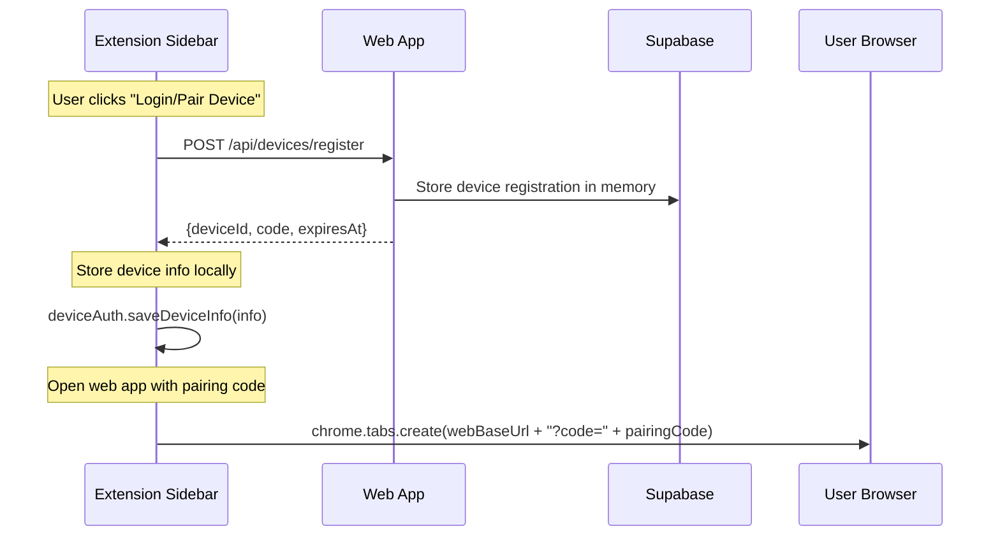
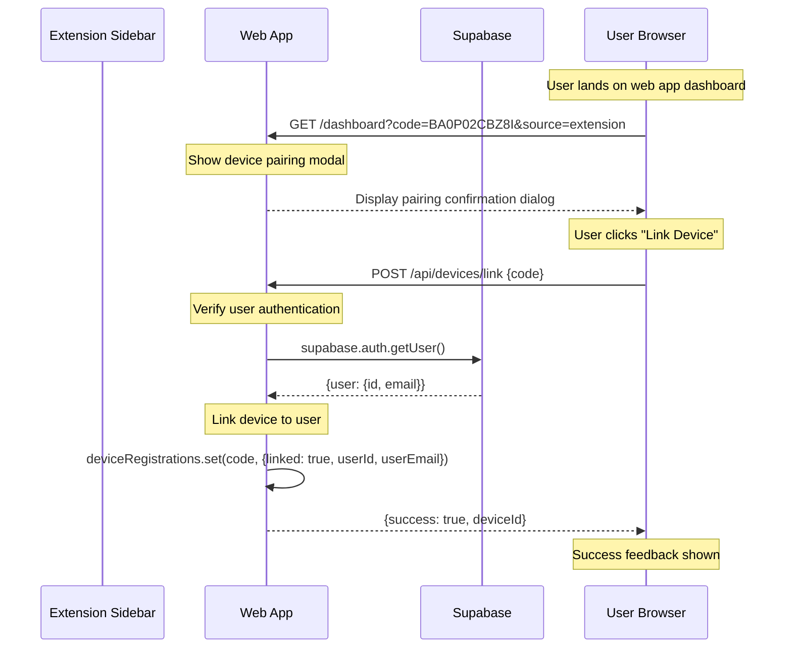
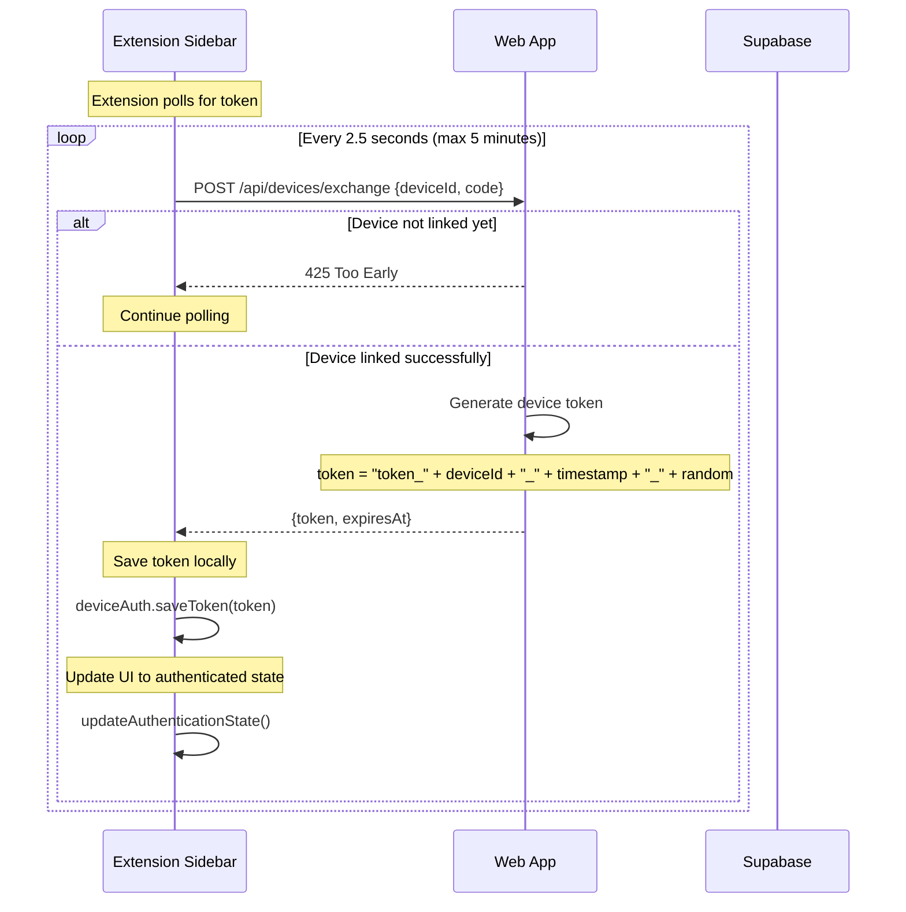
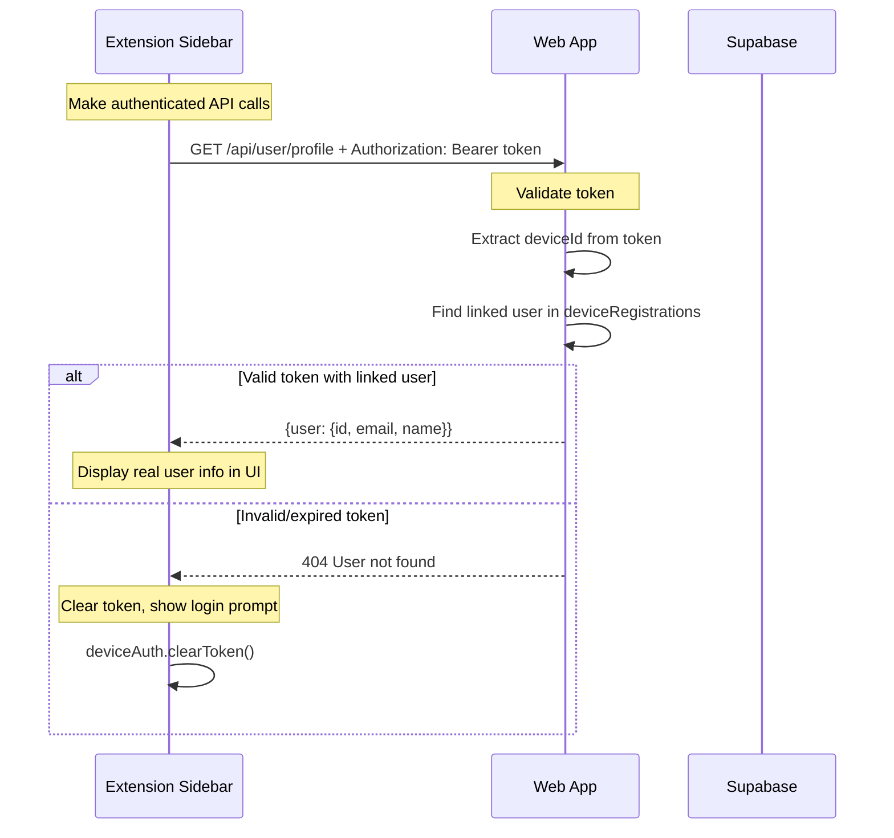

# Authentication Flow Specification
**Productory Powerups for Gamma - Device Pairing Architecture**

## Overview

This document defines the correct business logic for the Chrome Extension ↔ Web App authentication flow using device pairing. This is the **intended design** based on analyzing the current implementation gaps.

## Architecture Components

```
┌─────────────────┐    ┌─────────────────┐    ┌─────────────────┐
│  Chrome Extension │    │   Web App       │    │   Supabase      │
│  (Sidebar)      │    │  (Dashboard)    │    │  (Database)     │
└─────────────────┘    └─────────────────┘    └─────────────────┘
```

## Authentication Flow Sequence

### Phase 1: Device Registration



### Phase 2: User Authentication & Device Linking



### Phase 3: Token Exchange & Polling



### Phase 4: Authenticated API Calls



## Business Logic Rules

### Token Validation Strategy

1. **Presence Check**: Extension checks if device token exists locally
2. **Server Validation**: Extension validates token by calling `/api/user/profile`
3. **Automatic Cleanup**: Invalid tokens are cleared immediately
4. **Fresh Registration**: Failed validation triggers new device registration

```typescript
async isAuthenticated(): Promise<boolean> {
  const token = await deviceAuth.getStoredToken();
  if (token && token.token) {
    try {
      const user = await this.getCurrentUser(); // Validates against server
      return !!user; // Only true if server recognizes token
    } catch (error) {
      return false; // Invalid token = not authenticated
    }
  }
  return false;
}
```

### Device Registration Management

1. **In-Memory Storage**: Web app uses `globalThis.deviceRegistrations` Map
2. **Expiration Handling**: Expired registrations are automatically cleaned
3. **Code Uniqueness**: Each registration generates unique pairing code
4. **Single-Use Linking**: Device can only be linked once per code

### Error Handling Patterns

| Scenario | Extension Behavior | Web App Response |
|----------|-------------------|------------------|
| Stale token | Clear token, show login | 404 User not found |
| Expired registration | Generate new code | 404 Invalid code |
| Network error | Retry with backoff | Standard HTTP errors |
| User cancels pairing | Stop polling, show login | No action needed |

## State Management

### Extension States
- `LOGGED_OUT`: No device token
- `DEVICE_REGISTERED`: Has device info, no token
- `PAIRING_IN_PROGRESS`: Polling for token exchange
- `AUTHENTICATED`: Has valid token confirmed by server

### Web App States  
- `DEVICE_PENDING`: Registration created, awaiting user
- `DEVICE_LINKED`: User confirmed pairing
- `TOKEN_ISSUED`: Device token generated and returned

## Security Considerations

1. **Token Format**: `token_{deviceId}_{timestamp}_{random}`
2. **Expiration**: All tokens have defined expiry times
3. **Single Device**: Each device gets unique registration
4. **User Consent**: Explicit user confirmation required for linking
5. **Cleanup**: Automatic removal of stale registrations and tokens

## Implementation Checklist

### Extension Requirements
- [x] Device registration on login click
- [x] Token polling with timeout
- [x] Server-side token validation  
- [x] Automatic stale token cleanup
- [x] UI state updates based on authentication

### Web App Requirements
- [x] Device registration endpoint
- [x] User authentication verification
- [x] Device linking with user consent
- [x] Token generation and exchange
- [x] User profile API with token validation

### Integration Points
- [x] URL parameter passing for pairing codes
- [x] Cross-origin API calls with proper headers
- [x] Error handling and user feedback
- [x] Session persistence across browser restarts

## Troubleshooting Guide

### Common Issues

1. **Extension shows wrong device info**: Clear browser storage and restart
2. **Pairing code mismatch**: Check URL parameters vs extension debug info
3. **404 on profile API**: Verify token validity and user linking
4. **Infinite polling**: Check web app device registrations Map

### Debug Information

Extension provides comprehensive debug panel showing:
- Device Token status and expiration
- Device ID and pairing code
- API base URL configuration  
- User profile validation status
- Troubleshooting action buttons

---

**Document Status**: Living specification  
**Last Updated**: 2025-08-29  
**Version**: 1.0  