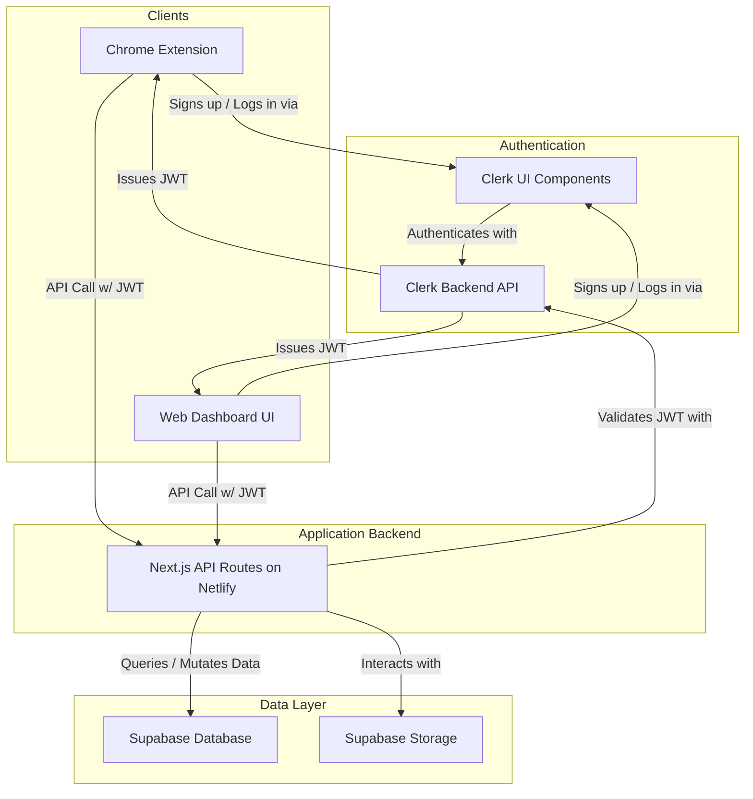

# Technical Specification: Backend Architecture for Gamma Timetable Extension

## 1. Overview

This document provides detailed technical specifications for implementing the backend services and user-facing applications using a modern, "vibe-coding friendly" stack.

- **Hosting, API, & Web App**: **Next.js on Netlify**
- **Authentication**: **Clerk**
- **Database & Storage**: **Supabase**

This stack prioritizes developer experience, scalability, and security by leveraging best-in-class specialized services for two clients: the **Chrome Extension** and a new **Web Dashboard**.

## 2. Architectural Diagram



## 3. Component Deep Dive

### 3.1 Clients

#### 3.1.1 Chrome Extension

The existing Chrome extension will be modified to communicate with the new backend API.

- **Auth UI**: It will feature a login component powered by Clerk. The UI for new users will consist of a link that opens the Web Dashboard's sign-up page in a new tab (`chrome.tabs.create`). It will not contain a sign-up form.

#### 3.1.2 Web Dashboard

A new web application, built as the frontend of our Next.js project, will provide users with a central place to manage their account and data.

- **Auth UI**: It will host the primary sign-up and login pages, as well as all account management interfaces, using Clerk's pre-built components.

### 3.2 Authentication: Clerk

Clerk will handle all user management and authentication, ensuring a unified session across both the extension and the web app.

- **Integration**: The extension will use the `@clerk/chrome-extension` package. The web app will use the `@clerk/nextjs` package.
- **Frontend**: We will use Clerk's pre-built React components. The Web Dashboard will host the `<SignUp />` component. Both the dashboard and the extension will use the `<SignIn />` and `<UserButton />` components for a consistent experience.
- **Configuration**:
  - Requires `CLERK_PUBLISHABLE_KEY` (public) and `CLERK_SECRET_KEY` (private).
  - The secret key will be stored securely as an environment variable in Netlify.
  - The publishable key will be embedded in the Chrome extension's build.

### 3.3 Database: Supabase

Supabase will serve as our primary data store.

- **Database Schema**:

  ```sql
  -- presentations table
  CREATE TABLE presentations (
    id UUID PRIMARY KEY DEFAULT gen_random_uuid(),
    user_id UUID NOT NULL,
    title TEXT NOT NULL,
    timings JSONB NOT NULL,
    created_at TIMESTAMPTZ NOT NULL DEFAULT now(),
    updated_at TIMESTAMPTZ NOT NULL DEFAULT now()
  );

  -- Function to update updated_at timestamp
  CREATE OR REPLACE FUNCTION update_updated_at_column()
  RETURNS TRIGGER AS $$
  BEGIN
     NEW.updated_at = now();
     RETURN NEW;
  END;
  $$ language 'plpgsql';

  -- Trigger to auto-update the timestamp
  CREATE TRIGGER update_presentations_updated_at
  BEFORE UPDATE ON presentations
  FOR EACH ROW
  EXECUTE PROCEDURE update_updated_at_column();
  ```

- **Row Level Security (RLS)**: RLS will be enabled on all tables containing user data to ensure users can only access their own information.

  ```sql
  -- Enable RLS on the table
  ALTER TABLE presentations ENABLE ROW LEVEL SECURITY;

  -- Policy: Users can only see their own presentations
  CREATE POLICY "user_can_read_own_presentations"
  ON presentations FOR SELECT
  USING (auth.uid() = user_id);

  -- Policy: Users can only insert presentations for themselves
  CREATE POLICY "user_can_create_own_presentations"
  ON presentations FOR INSERT
  WITH CHECK (auth.uid() = user_id);

  -- Policy: Users can only update their own presentations
  CREATE POLICY "user_can_update_own_presentations"
  ON presentations FOR UPDATE
  USING (auth.uid() = user_id);
  ```

- **Connection**: The Next.js API will use the `@supabase/supabase-js` library and connect using the `SUPABASE_URL` and `SUPABASE_SERVICE_ROLE_KEY` environment variables stored in Netlify.

### 3.4 API Layer & Web App: Next.js on Netlify

The Next.js application will serve two primary roles:

1.  **API Backend**: A set of serverless functions providing data access to all clients.
2.  **Web Dashboard Frontend**: A React-based user interface for the web dashboard.

- **Structure**:
  - API logic will reside in the `pages/api` directory.
  - React components for the web dashboard will reside in standard Next.js directories (`pages`, `components`, etc.).
- **Protected Routes & Pages**:
  - **API**: We will use Clerk's `withApiAuth` helper to protect API routes.
  - **Web App**: We will use Clerk's `withServerSideAuth` for server-side rendered (SSR) pages or the `<SignedIn>`/`<SignedOut>` components for client-side protection to ensure only authenticated users can access the dashboard.
- **Example Protected Route**:

  ```typescript
  // pages/api/presentations/index.ts
  import { withApiAuth } from '@clerk/nextjs/api';
  import { createClient } from '@supabase/supabase-js';

  const supabase = createClient(process.env.SUPABASE_URL!, process.env.SUPABASE_SERVICE_ROLE_KEY!);

  export default withApiAuth(async (req, res) => {
    const { userId } = req.auth;

    if (req.method === 'GET') {
      const { data, error } = await supabase
        .from('presentations')
        .select('*')
        .eq('user_id', userId);

      if (error) return res.status(500).json({ error: error.message });
      return res.status(200).json(data);
    }
    // ... handle POST, etc.
  });
  ```

## 4. Data Flow Example: New User Sign-Up

1.  A new user in the Chrome Extension clicks the "Create an account" link.
2.  The extension calls `chrome.tabs.create({ url: 'https://<your-netlify-domain>/sign-up' })` to open the web app's sign-up page.
3.  The user completes the sign-up process using the Clerk component on the Web Dashboard.
4.  Upon successful sign-up, Clerk creates the user record and establishes an active session in the browser for the web app domain.
5.  When the user returns to the Chrome Extension, the Clerk SDK (`@clerk/chrome-extension`) communicates with Clerk's servers, recognizes the active session for the instance, and automatically authenticates the user within the extension.
6.  The user is now seamlessly logged in on both clients.

## 5. Setup & Deployment

1.  Create a project on [Clerk](https://clerk.com/).
2.  Create a project on [Supabase](https://supabase.com/).
3.  Create a new Next.js project and deploy it to Netlify, linking the Git repository for CI/CD.
4.  Configure the following environment variables in the Netlify project settings:
    - `NEXT_PUBLIC_CLERK_PUBLISHABLE_KEY`
    - `CLERK_SECRET_KEY`
    - `NEXT_PUBLIC_SUPABASE_URL`
    - `SUPABASE_SERVICE_ROLE_KEY`
5.  Run the SQL scripts in the Supabase dashboard to set up tables and RLS policies.
6.  Develop the API routes and extension frontend. Pushing to the main branch will trigger automatic deployments on Netlify.
