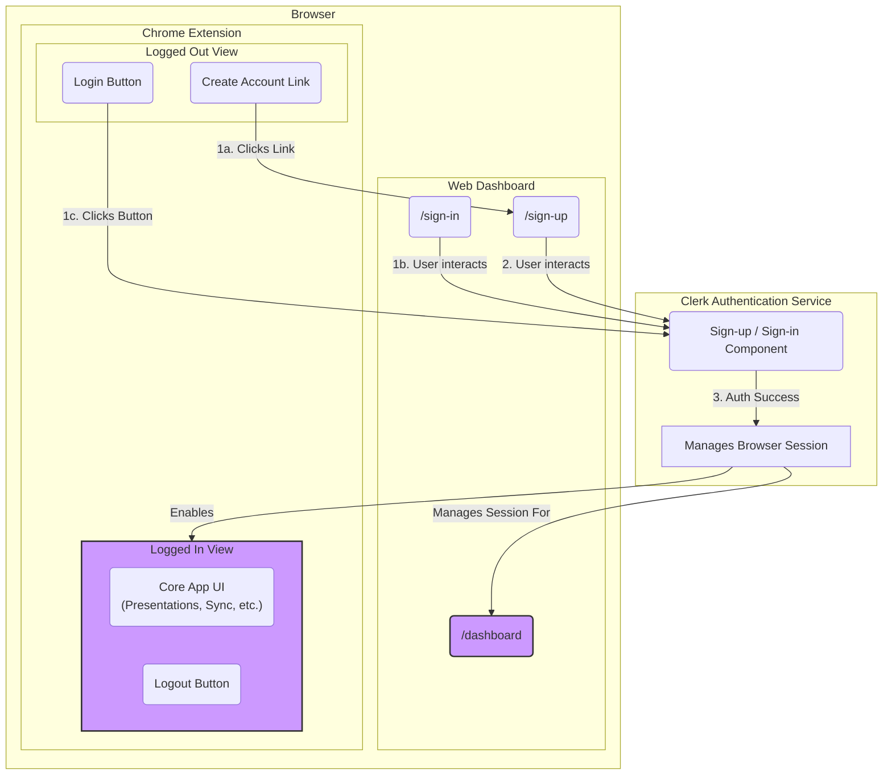

# App Flow: User Onboarding & Authentication

## 1. Overview

This document outlines the complete user flow for account creation and login across the two main clients: the **Web Dashboard** and the **Chrome Extension**. The primary goal is to create a seamless, unified authentication experience managed by **Clerk**.

The key principles of this flow are:
- **Centralized Sign-Up:** New user registration occurs **exclusively** on the Web Dashboard to provide a consistent and controlled onboarding experience.
- **Unified Session:** A user who logs into one client is automatically authenticated on the other within the same browser, creating a frictionless journey between the app and the extension.

---

## 2. The User Journey

### 2.1. Flow Diagram

### 2.2. New User Sign-Up Flow

This flow begins when a user who does not have an account wants to join.

1.  **Trigger (from Extension):** Inside the Chrome Extension's **Logged Out View**, the user sees a simple interface with two options: a "Login" button and a **"Create an account"** link. They click the link.
2.  **Action (Browser):** The extension opens a new tab directed to the Web Dashboard's `/sign-up` page.
3.  **Authentication (Clerk):** The user interacts with the Clerk sign-up component embedded on the page.
4.  **Success:** Upon successful registration, Clerk redirects the user to the main `/dashboard` page of the Web Dashboard.
5.  **Unified Session:** The Chrome Extension, now aware of the active browser session managed by Clerk, automatically switches from the `Logged Out View` to the `Logged In View`.

### 2.3. Returning User Login Flow

This flow applies to existing users and can be initiated from either the Web Dashboard or the Chrome Extension.

#### Path A: Login from the Web Dashboard
1.  **Trigger:** A logged-out user visits the `/sign-in` page on the Web Dashboard.
2.  **Authentication & Success:** The user logs in via the Clerk component and is redirected to the `/dashboard`. The extension automatically reflects the new session.

#### Path B: Login from the Chrome Extension
1.  **Trigger:** The user clicks the **"Login"** button within the Chrome Extension's **Logged Out View**.
2.  **Authentication (Clerk):** The Clerk sign-in component is presented to the user.
3.  **Success & Unified Session:** Upon successful login, the extension's UI immediately switches to the `Logged In View`. The session is now active for the entire browser.

### 2.4. Logged-In Extension View

Once authenticated, the user is presented with the core functionality of the extension:
- A list of their presentations, fetched from the backend.
- Controls to manually or automatically sync their data ("Save to Cloud", "Load from Cloud", etc.).
- A "Logout" button to securely end their session.
- A convenient link to open their full Web Dashboard in a new tab. 