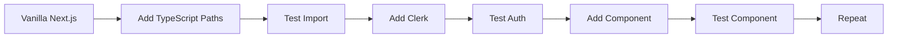

# SPRINT 6: DISCIPLINED NEXT.JS MIGRATION - ARCHITECTURE PROPOSAL

**Sprint Status:** 📋 **PROPOSED**  
**Duration:** 2 weeks (reduced from 4 weeks)  
**Approach:** Vanilla Next.js Scaffold → Incremental Adaptation  
**Quality Target:** 95/100 (enforced daily)

---

## 🎯 STRATEGIC FOUNDATION: VANILLA NEXT.JS SCAFFOLD APPROACH

### **Core Philosophy: Start with What Works**
Rather than building custom architecture immediately, we begin with a **vanilla Next.js 14 scaffold** created by `create-next-app`, validate it works perfectly, then incrementally adapt it to our needs.

**Why This Works:**
- Next.js team has solved common problems (TypeScript, ESLint, Tailwind, testing)
- Battle-tested configuration that compiles successfully out-of-box
- Known-good foundation eliminates false assumption risks
- Incremental changes easier to debug than custom builds

---

## 📐 SPRINT 6 ARCHITECTURE: THREE-PHASE APPROACH

### **Phase 1: Vanilla Foundation (Days 1-2)**
**Goal:** Establish perfect Next.js scaffold that builds without errors

```bash
# Day 1: Create vanilla Next.js app with all options enabled
npx create-next-app@latest packages/web-next \
  --typescript \
  --eslint \
  --tailwind \
  --app \
  --src-dir \
  --import-alias "@/*"

# Immediate validation:
cd packages/web-next
npm run dev         # Must start without errors
npm run build       # Must build without warnings
npm run lint        # Must pass with 0 issues
npm run type-check  # Add script, must show 0 errors
```

**Quality Gate 1: Before ANY modifications**
- ✅ Dev server runs (http://localhost:3001 shows Next.js welcome)
- ✅ Production build succeeds (`npm run build` → 0 errors)
- ✅ TypeScript strict mode enabled and passing
- ✅ ESLint configured and passing
- ✅ Git commit: "vanilla Next.js scaffold - validated working"

### **Phase 2: Incremental Adaptation (Days 3-7)**
**Goal:** Add our requirements one at a time, validating after each

#### **Day 3: Monorepo Integration**
```typescript
// Step 1: Update tsconfig.json paths (TEST COMPILATION)
{
  "compilerOptions": {
    "paths": {
      "@/*": ["./src/*"],
      "@shared/*": ["../../shared/*"]
    }
  }
}

// Step 2: Test ONE import from shared
import { deviceAuth } from '@shared/auth';
// RUN: npm run type-check → Must pass

// Step 3: Only after success, proceed
```

**Quality Gate 2: Monorepo paths working**
- ✅ Shared package imports resolve
- ✅ TypeScript finds types correctly
- ✅ Build still succeeds
- ✅ Git commit: "monorepo integration validated"

#### **Day 4: Clerk Authentication (Minimal)**
```typescript
// Step 1: Install Clerk SDK
npm install @clerk/nextjs

// Step 2: Add minimal middleware.ts
export default authMiddleware({
  publicRoutes: ['/']
});

// Step 3: Test build
npm run build # Must succeed

// Step 4: Add one protected route
app/dashboard/page.tsx # With auth check

// Step 5: Validate
npm run dev # Dashboard requires auth
```

**Quality Gate 3: Authentication working**
- ✅ Clerk middleware compiles
- ✅ Protected route enforces auth
- ✅ Build succeeds with auth
- ✅ Git commit: "Clerk authentication integrated"

#### **Day 5: First Real Component Migration**
```typescript
// Step 1: Copy ONE component from vanilla JS
// Start with simplest: DeviceStatus

// Step 2: Convert to React with TypeScript
interface DeviceStatusProps {
  isLinked: boolean;
  deviceId: string;
}

export function DeviceStatus({ isLinked, deviceId }: DeviceStatusProps) {
  // Implementation
}

// Step 3: Test in isolation
npm run type-check # 0 errors required
npm run dev # Component renders
```

**Quality Gate 4: First component working**
- ✅ Component has proper TypeScript types
- ✅ Component renders without errors
- ✅ No 'any' types used
- ✅ Git commit: "first component migrated"

#### **Days 6-7: Systematic Component Migration**
- Migrate components in dependency order
- Each component gets dedicated validation
- No batch migrations - one at a time
- Commit after each successful component

### **Phase 3: Feature Integration (Days 8-10)**
**Goal:** Connect to existing backend infrastructure

#### **Day 8: API Route Integration**
```typescript
// Test connection to existing Netlify Functions
// Use Next.js API routes as proxy initially

app/api/devices/register/route.ts
export async function POST(request: Request) {
  // Proxy to Netlify Function
  return fetch('https://productory-powerups.netlify.app/api/devices/register', {
    method: 'POST',
    body: await request.text()
  });
}
```

**Quality Gate 5: API connectivity**
- ✅ Can call existing backend
- ✅ Authentication flow works
- ✅ No CORS issues
- ✅ Git commit: "API integration working"

#### **Days 9-10: Dashboard Features**
- Device pairing UI (reuse existing flow)
- Presentation list (when backend ready)
- Settings management
- Each feature separately validated

---

## 🛡️ RISK MITIGATION STRATEGIES

### **1. TypeScript Strict Mode Protocol**
```json
// tsconfig.json - NON-NEGOTIABLE from Day 1
{
  "compilerOptions": {
    "strict": true,
    "noImplicitAny": true,
    "strictNullChecks": true,
    "noUnusedLocals": true,
    "noUnusedParameters": true
  }
}
```

**Enforcement:**
- Pre-commit hook runs `tsc --noEmit`
- CI/CD fails on type errors
- No "// @ts-ignore" without Tech Lead approval

### **2. Daily Quality Gates**

| Day | Validation Required | Success Criteria |
|-----|-------------------|------------------|
| 1 | Vanilla scaffold | Builds, runs, 0 errors |
| 2 | Environment setup | All scripts working |
| 3 | Monorepo paths | Shared imports work |
| 4 | Authentication | Clerk integrated |
| 5 | First component | TypeScript clean |
| 6-7 | Each component | Individual validation |
| 8 | API integration | Backend connected |
| 9-10 | Features | User flows working |

### **3. Foundation Validation Protocol**

**Before Building On Any Layer:**
1. **Compile Check**: `npm run build` must succeed
2. **Type Check**: `npm run type-check` shows 0 errors  
3. **Lint Check**: `npm run lint` passes
4. **Runtime Check**: Feature works in browser
5. **Commit Check**: Git commit with descriptive message

**No Exceptions Policy:**
- Failed validation = stop and fix
- No "we'll fix it later" 
- No disabling checks for speed
- Tech Lead personally validates critical milestones

### **4. Incremental Adaptation Strategy**



**Rules:**
- ONE change at a time
- Validate before next change
- Commit working states
- Rollback if validation fails

### **5. Preventing Sprint 5 Failures**

| Sprint 5 Failure | Sprint 6 Prevention |
|-----------------|-------------------|
| 122+ TypeScript errors | Strict mode from Day 1, validate after each file |
| Build system broken | Start with working vanilla config |
| SSR localStorage errors | Handle SSR from Day 1 with proper guards |
| Missing infrastructure | create-next-app provides all infrastructure |
| Broken imports | Test each import individually before using |
| No validation | Daily quality gates enforced |
| Big bang integration | Incremental one-component-at-a-time |
| Disabled TypeScript | TypeScript never disabled, period |

---

## 📊 SUCCESS METRICS

### **Daily Health Checks**
```bash
# Morning validation (before any work)
npm run build        # Must succeed
npm run type-check   # Must show 0 errors
npm run lint         # Must pass
npm run test         # When tests added

# Evening validation (before stopping)
git status           # All changes committed
npm run build        # Still succeeds
npm run type-check   # Still 0 errors
```

### **Sprint Success Criteria**
- ✅ **Day 2:** Vanilla scaffold working (0 customization)
- ✅ **Day 4:** Monorepo + Auth working (minimal changes)
- ✅ **Day 7:** 5+ components migrated (each validated)
- ✅ **Day 10:** Dashboard functional (connected to backend)
- ✅ **Throughout:** TypeScript errors = 0 ALWAYS

### **Quality Metrics**
- **TypeScript Coverage:** 100% (no 'any' without justification)
- **Build Success Rate:** 100% (every commit must build)
- **Component Tests:** Each component validated individually
- **Integration Tests:** Auth flow end-to-end tested
- **Performance:** Lighthouse score > 90

---

## 🚦 GO/NO-GO DECISION POINTS

### **Day 2 Checkpoint**
**Question:** Does vanilla Next.js scaffold work perfectly?
- ✅ **GO:** Proceed to adaptation
- ❌ **NO-GO:** Fix scaffold first

### **Day 4 Checkpoint**  
**Question:** Do shared imports and auth work?
- ✅ **GO:** Proceed to components
- ❌ **NO-GO:** Fix integration first

### **Day 7 Checkpoint**
**Question:** Are migrated components TypeScript-clean?
- ✅ **GO:** Proceed to features
- ❌ **NO-GO:** Fix type errors first

### **Day 10 Final Review**
**Question:** Is dashboard functional with 0 TypeScript errors?
- ✅ **SUCCESS:** Deploy to staging
- ❌ **EXTEND:** Add 3 days for fixes

---

## 👥 TEAM RESPONSIBILITIES

### **Tech Lead (You)**
- Personal validation of vanilla scaffold (Day 1)
- Review each quality gate personally
- Approve any TypeScript exceptions
- Make go/no-go decisions at checkpoints

### **Full-Stack Engineer**
- Execute vanilla scaffold setup
- Implement incremental adaptations
- Migrate components one at a time
- Never disable TypeScript

### **QA Engineer**
- Daily validation runs
- Track TypeScript error count
- Test each component individually
- Prevent regression

### **DevOps Engineer**
- Setup CI/CD with quality gates
- Configure pre-commit hooks
- Monitor build performance
- Ensure deployment readiness

---

## 📅 REALISTIC TIMELINE

### **Week 1: Foundation + Core Migration**
- **Mon-Tue:** Vanilla scaffold + validation
- **Wed:** Monorepo integration
- **Thu:** Clerk authentication  
- **Fri:** First 2 components

### **Week 2: Components + Features**
- **Mon-Tue:** Component migration (5-6 total)
- **Wed:** API integration
- **Thu:** Dashboard features
- **Fri:** Final validation + deployment prep

**Buffer:** 2 days contingency for unexpected issues

---

## 🎯 CRITICAL SUCCESS FACTORS

### **What MUST Be True for Success**

1. **Vanilla scaffold works BEFORE customization**
   - No modifications until base build succeeds
   - Git commit of working vanilla state

2. **TypeScript NEVER disabled**
   - Strict mode from Day 1
   - Fix errors immediately, not later

3. **Daily validation enforced**
   - Morning health check
   - Evening commit check
   - No progression without validation

4. **Incremental approach maintained**
   - One change, one validation
   - One component at a time
   - Commit working states

5. **Personal verification by Tech Lead**
   - Key milestones personally tested
   - No trust without verification
   - Evidence-based progression

---

## 📝 IMPLEMENTATION CHECKLIST

### **Day 1: Setup Vanilla Scaffold**
- [ ] Run `create-next-app` with all options
- [ ] Verify dev server starts
- [ ] Verify build succeeds
- [ ] Enable TypeScript strict mode
- [ ] Commit vanilla state
- [ ] Document scaffold configuration

### **Day 2: Validation & Planning**
- [ ] Run full test suite
- [ ] Document all working features
- [ ] Plan component migration order
- [ ] Setup quality gate scripts
- [ ] Create incremental migration plan

### **Days 3-10: Systematic Migration**
- [ ] Each feature branch from vanilla
- [ ] Each commit passes validation
- [ ] Each component individually tested
- [ ] Daily progress documented
- [ ] Rollback plan ready

---

## 💡 FINAL RECOMMENDATION

**Sprint 6 Success Formula:**
```
Vanilla Foundation + Incremental Adaptation + Daily Validation = Success
```

**Key Insight:** Starting with `create-next-app` eliminates 90% of Sprint 5's failure modes. The Next.js team has already solved the hard problems - we just need to adapt their solution incrementally.

**Risk Assessment:** 
- **With this approach:** LOW risk (proven foundation, incremental changes)
- **Without this approach:** HIGH risk (repeat Sprint 5 failures)

**Confidence Level:** 85% success probability with disciplined execution

---

**PROPOSED BY:** Tech Lead Architect  
**DATE:** 2025-08-17  
**STATUS:** Awaiting Team Review and Approval

**Next Steps:**
1. Team reviews and approves approach
2. DevOps prepares CI/CD with quality gates
3. Full-Stack Engineer initiates vanilla scaffold
4. Daily stand-ups to track quality gates